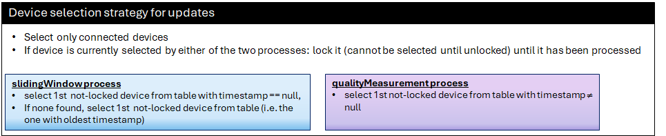

but the approach to select the next device to be added to the slidingWindow has been changed.  
Instead of using the deviceList as input, the MWDI now will utilize the information in the metadata status table to determine the next update candidate.  

Now the slidingWindow and the qualityMeasurement process will both update ControlConstructs in the cache in an aligned fashion:
- for the slidingWindow the next update candidate is either a connected device where no ControlConstruct is currently in the cache (highest priority) or, if no such device is found, the device which has the oldest ControlConstruct in the cache
- for the qualityMeasurement process devices without an already existing ControlConstruct in the cache are ignored

The selection of the next candidate now completely capsulated inside the */v1/provide-device-status-metadata* service. It can be controlled by handing over the following inputs to the timestamp filter (requestBody):
- slidingWindow: "oldest-or-null"
- qualityMeasurement: "oldest"

