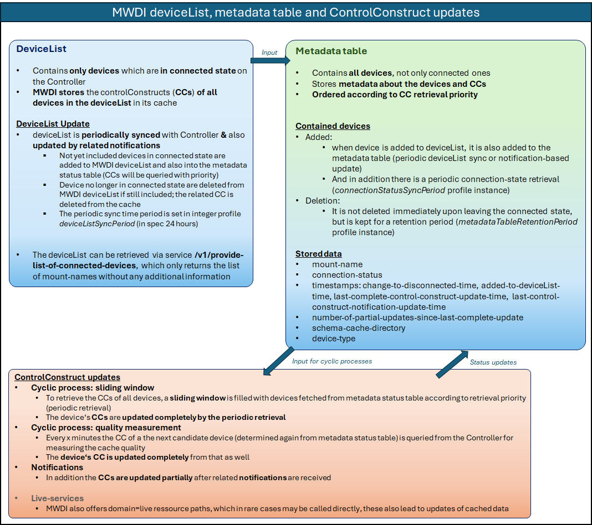
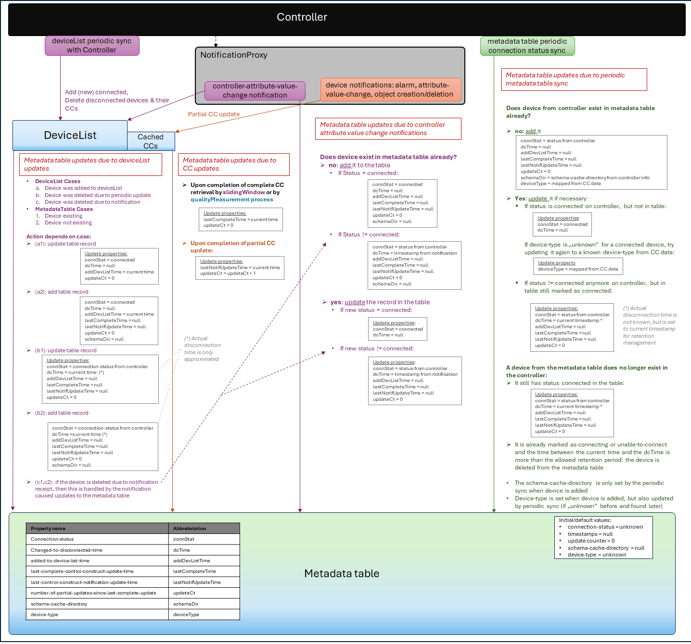
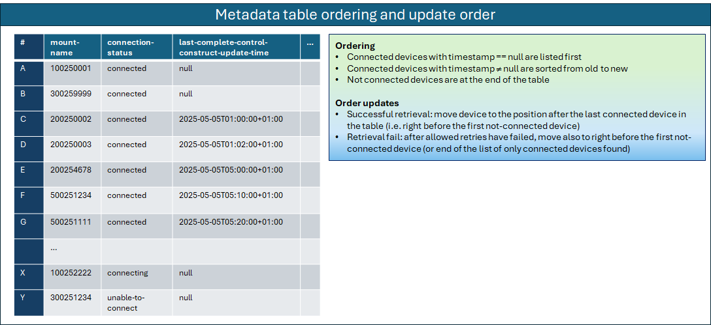

This page describes the process for updating the MWDI metadata table kept in the ElasticSearch database.  
It also describes the related profileInstances and their usage.

The metadata table is not to be confused with the MWDI's deviceList.  
- deviceList: stores only the list of currently connected devices
  - is updated according to periodic syncs with the controller
  - and through notifications about controller status changes
  - up to MWDI 1.2.x it was used as base for retrieving device ControlConstructs periodically (slidingWindow)
- metadata table: stores all devices from the controller with their connection status and additional metadata.  
  - is also update according to the deviceList periodic syncs with the controller,
  - but in addition has also an own periodic sync,
  - as well as being updated due to the controller status notifications
  - is ordered according to connection state and timestamp of the last complete control construct update
  - is used to determine the next update candidate for both slidingWindow and qualityMeasurement process (since MWDI 1.3.0)

Although the deviceList no longer is used as base for the cyclic cache updates anymore directly, it still plays an important role in updating the metadata status table, which now is used as the base for the cyclic updates. Also deletions of devices from the deviceList will lead to their respective cached ControlConstructs being deleted from the cache.  

The following picture outlines the differences between both shortly:  

  

-----------------------------------------------------
## Relevant profileInstances

The profileInstances directly relevant to the metadata table update cycle and retention are connectionStatusSyncPeriod and metadataTableRetentionPeriod.  

**`connectionStatusSyncPeriod`**
- The connection-status of all devices mounted on the controller is retrieved periodically according to the time interval specified here.
- Under normal conditions, the MWDI should receive notifications from NotificationProxy about devices changing their connection status, however notifications may be lost (e.g. due to connection errors). Therefore, a periodic sync is executed.
- After each connectionStatusSyncPeriod hours the current metadata table entries are compared against the Controller information and updated accordingly.

-----------------------------------------------------
## Building and updating the metadata table

The following picture aims at providing an overview about how the metadata table is updated.  

As can be seen, the metadata table is updated due to
- deviceList updates according to the periodic deviceList sync (pink),
- periodic connection-status sync with the controller (green)
- or when there are changes to a controlConstruct  
  - from either the periodic complete controlConstruct retrieval (either by slidingWindow (pink) or qualityMeasurement (blue)),
  - or triggered by notifications
  - _note: the controlConstruct can also be updated by calling MWDI live paths_ directly _(e.g. from other applications, not as part of the qualityMeasurement process). This, however, is ignored for the metadata table update currently._

Also note that an attribute being _null_ shall be represented by an empty string. 

-----------------------------------------------------
## Filtering of metadata

There are two options for data retrieval. The filter is mandatory and provided in the requestBody:
- **_MountNameList_**: when the service is called, a mount-name list can be handed over as input.
  - The metadata table data is filtered for devices found in the list.
  - Data for other devices is not returned.
- **_TimestampFilter_**: the 2nd option is a filter on the *last-complete-control-construct-update-time* property.
  - It shall return an output list with only a single device record (if found).
  - Only devices in *connected* state are to be considered.
  - Depending on the provided value, the data shall be filtered for the device with:
    - the oldest, not-null timestamp value: this will be used for the quality measurements
    - or for the oldest or null timestamp value (if there are multiple devices with null timestamps, take the first one found): this is to be used for the regular cyclic CC updates (slidingWindow process)

----
ordering picture:

