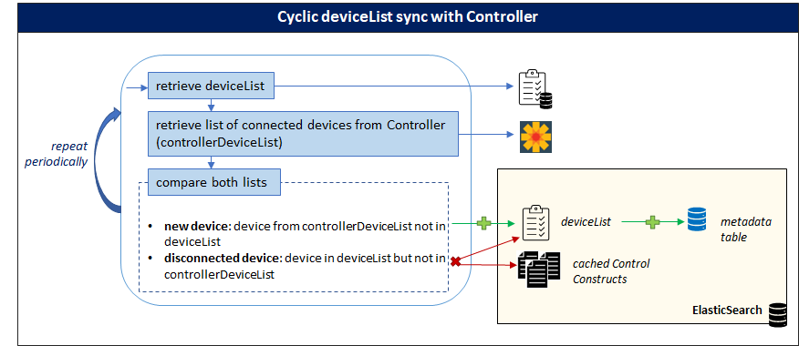
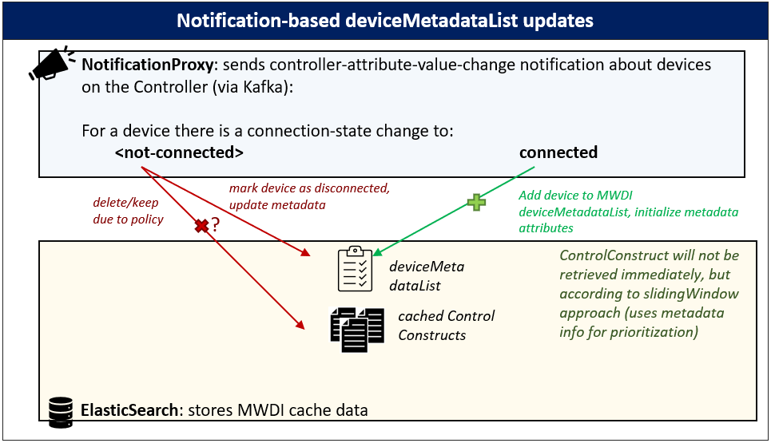

# Cyclic process for updating the MWDI cache by uploading the ControlConstruct

This page describes the cyclic process for updating the MWDI cache by uploading and maintaining the ControlConstruct data of (connected) devices to/in the ElasticSearch database. It also describes the related profileInstances and their usage.

The MWDI caches the ControlConstructs of all devices, which are in connected state at the Controller. This is done via a cyclic process. 
To build and update the cache, first the list of connected devices needs to be obtained. It is constantly updated if device connection-state changes occur on the Controller. Based on the deviceList, the ControlConstructs can be retrieved from the devices by a sliding window approach. Retrieved ControlConstructs are then written to the cache, i.e. an ElasticSearch database.

---
## Relevant profileInstances

The profileInstances relevant to the update process are slidingWindowSize, responseTimeout, maximumNumberOfRetries, deviceListSyncPeriod and ControllerInternalPathToMountPoint.

**`slidingWindowSize`**  
- The ControlConstructs (CC) of all devices need to be retrieved periodically
- It is not feasible to query all CCs in parallel at once or sequentially – the sliding window combines both approaches. 
- **constantly a specified number (=slidingWindowSize**, initally 500) **of devices are queried for their ControlConstructs in parallel**; once a request is finished the next device from the MWDI deviceList is added to the slidingWindow retrieval list. Once all devices from the MWDI device list have been queried, the retrieval starts again at the start of the deviceList.
- Note: the slidingWindow retrieval only is used for periodic CC retrieval, not for individual live paths (to update only certain parts of the CC).
- (initial) configuration: 500

**`responseTimeout`**
- The responseTimeout is used to **specify how long the MWDI shall wait for the Controller answering a (CC) retrieval request.**
- **When the request for control-construct is sent to the Controller, the responseTimeout should be sent along with the request.**
- This should also be done for the individual live path requests.
- The timeout profileInstance initially is set to 900 seconds, which is also the timeout that is currently configured on the Controller.
- (initial) configuration: 900

**`maximumNumberOfRetries`**  
- Due to timeouts, connection errors or other issues it may not be possible to retrieve the CC for a given device. In order to not lose to much data, there can be retries for the CC retrieval.
- **When a device from the slidingWindow is queried and the retrieval fails, the retrieval should be retried as many times as configured in maximumNumberOfRetries.**
- (initial) configuration: 1

**`deviceListSyncPeriod`**  
- **The deviceListSyncPeriod determines in which intervals the MWDI deviceList is synced with the list of connected devices from the Controller**
- The MWDI deviceList stores the devices for which the MWDI knows that they are connected to the Controller. If (new) devices come into connected state or if (existing) devices leave connected state on the Controller, the MWDI normally receives a notification from the NotificationProxy to update its deviceList. However, those notifications may be lost e.g. due to connection errors. This is why a periodic sync is necessary. (The sync also needs to be done once at MWDI startup to build the initial deviceList) 
- After each deviceListSyncPeriod hours the current MWDI deviceList needs to be compared to the list of connected devices on the Controller and then has to be modified accordingly.

**`ControllerInternalPathToMountPoint`**  
- The actual path to the mount-point inside the Controller depends on the used Controller (currently ODL). After the mount-point has been reached the subsequent parts of the path are the same across different Controllers.
- The profileInstance allows to **configure the path to the mount-point depending on the used Controller**. The related **path-parameter** `{controller-internal-path-to-mount-point}`, which is **used in all operation-clients of the OpenDaylight client-stack**, contains a reference to the profileInstance information inside the ConfigFile.
- (initial) configuration: `rests/data/network-topology:network-topology/topology=topology-netconf`

---
## Building and updating the list of connected devices managed by the MWDI

The MWDI manages the deviceList. This list is initially built by retrieving the list of connected devices from the Controller at MWDI startup.
After the initial deviceList has been created is must constantly be updated, this happens via:
- periodic deviceList sync with the list of connected devices on the Controller 
- notifications received from the NotificationProxy (NP),  handled by MWDI operation `/v1/regard-controller-attribute-value-change`

Theoretically, it would suffice to just build the deviceList once and then update it according to the received notifications. But as the notifications can e.g. get lost due to connection errors, it is not sufficient to rely only on the notifications. Thus, the periodc sync needs to be executed as well.

### Periodic deviceList synchronization

The MWDI stores its list of managed devices inside the deviceList. At MWDI startup this deviceList is initialized with all the list of all devices in connected state on the Controller. Afterwards the deviceList is periodically synchronized with the Controller. 
The steps for the update are as follows:
-	retrieve the MWDI deviceList from the ElasticSearch database (deviceList)
-	retrieve the list of connected devices from the Controller (controllerDeviceList)
-	[new devices – add to deviceList]: all devices found on the controllerList, but not on the deviceList 
-	[disconnected devices – delete from deviceList]: all devices from the deviceList which are no longer found in the controllerDeviceList
-	Repeat after the time specified in profileInstance `deviceListSyncPeriod`

Note: deleting a device from the MWDI deviceList also means, that the cached ControlConstruct for the device is deleted from the ElasticSearch database.

### Notification-based deviceList update

The MWDI receives notifications about controller-attribute-value-changes from the NotificationProxy.   
For the related device from the notification:
-	connection-status == *connected*: add the device to the MWDI deviceList
-	connection-status != *connected*: if the device was part of the MWDI deviceList it is now deleted from the MWDI, together with its cached ControlConstruct

---
## ControlConstruct retrieval

A ControlConstruct for a device is updated by first retrieving it from the Controller via sending a live path request (`/core-model-1-4:network-control-domain=live/control-construct={mountName}`), and upon receipt the ControlConstruct is written to the ElasticSearch database.

To update the MWDI cache the deviceList is used as input to a cyclic operation which processed the list in a sliding window approach. 
This means, that a configured amount of devices is queried in parallel. Once a retrieval is finished the next device from the deviceList is added to the sliding window until all devices have been queried. When the end of the list is reached, the process just starts again at the start of the list. 
If the retrieval fails for a device, retries are allowed until the limit from maximumNumberOfRetries is reached.

The above table shows the relevant profileInstances for configuration of the retrieval process: 
-	the slidingWindowSize to specify the number of parallel requests
-	the responseTimeout to specify on how long to wait for an answer from the Controller
-	the maximumNumberOfRetries to specify how many retries are allowed in case of failure

Upon successful retrieval, the ControlConstruct is written to the ElasticSearch database.

*Note that ControlConstructs for new devices are not retrieved immediately, but only once there is an open slot in the sliding window. Retrieval for new devices should be prioritized over updating already cached ControlConstructs. 
The actual retrieval strategy for adding the devices to the sliding window chosen by the implementer should take this into consideration.*

The picture provides an example for the ControlConstruct retrieval using a sliding window.

### ControlConstruct updates which are not part of the cyclic process

For the sake of completeness it also should be mentioned that there are two mechanisms to ensure more frequent updates to the cached control constructs, which are not part of the cyclic process described above.  
These mechanisms are:

-	notification-based updates of ControlConstruct parts
-	user-initated updates of ControlConstruct parts

**Notification-based updates**  
The NotificationProxy sends notifications if there are changes on the devices. These notifications namely are about device alarms, attribute changes, object creations and object deletions.
Depending on the respective notification the cached ControlConstruct is modified accordingly. For all except one of those notifications no requests are sent to the Controller, as the notifications already contain all relevant information. For the object creation, however, the new objet first needs to be retrieved via a *live* path request.

**User-initiated updates**  
Certain parts of the ControlConstruct can be updated upon “user” demand. I.e. if another application calls a *live* path for e.g. the air interface capabilities, they are retrieved from the device and then the air interface capabilities inside the cached ControlConstruct are updated with the newly retrieved information. The other parts of the ControlConstruct are not updated by this.
