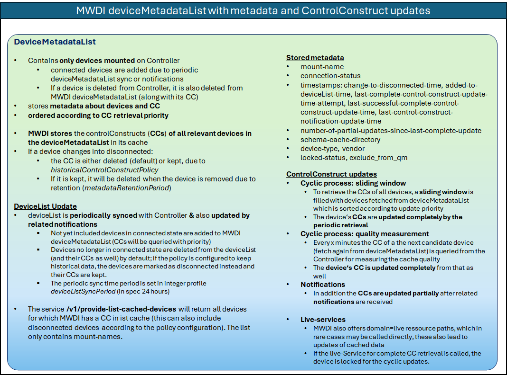
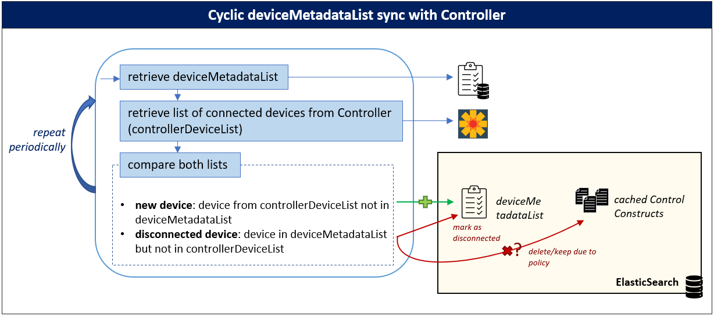
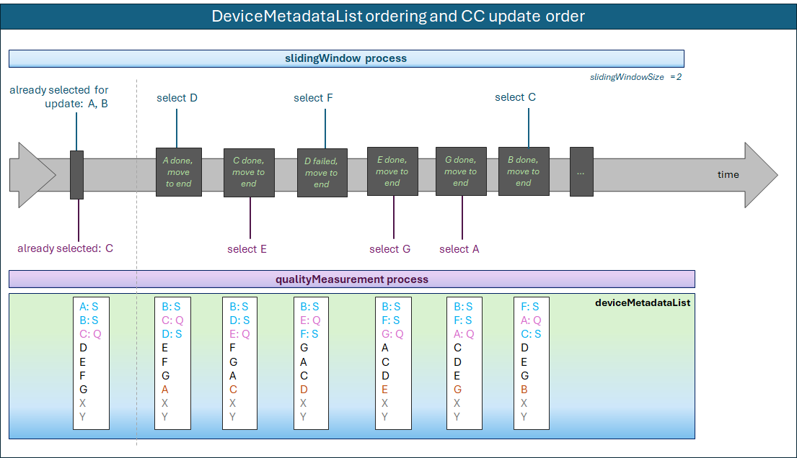

# Cyclic process for updating the MWDI cache by uploading the ControlConstruct

This page describes the cyclic process for updating the MWDI cache by uploading and maintaining the ControlConstruct data of (connected) devices to/in the ElasticSearch database. It also describes the related profileInstances and their usage.

The MWDI caches the ControlConstructs of all devices, which are in connected state at the Controller. This is done via a cyclic process. 
To build and update the cache, first the list of connected devices needs to be obtained. It is constantly updated if device connection-state changes occur on the Controller. 
Based on the deviceMetadataList, the ControlConstructs can be retrieved from the devices. Retrieved ControlConstructs are then written to the cache, i.e. an ElasticSearch database.

Up till MWDI 1.2.x the retrieval was done via a slidingWindow approach. With introduction of the qualityMeasurement process in MWDI 1.3.x, this has been changed, as both the cyclic process and the qualityMeasurement process are working together in updating the Cache.

*Note that deviceMetadataList is also referred to as only* deviceList *(e.g. in profileInstances or diagrams) too keep naming short.*

---
## Relevant profileInstances

The profileInstances relevant to the update process are slidingWindowSize, responseTimeout, maximumNumberOfRetries, deviceListSyncPeriod, ControllerInternalPathToMountPoint and metadataRetentionPeriod.

**`slidingWindowSize`**  
- The ControlConstructs (CC) of all devices need to be retrieved periodically
- It is not feasible to query all CCs in parallel at once or sequentially – the sliding window combines both approaches. 
- **constantly a specified number (=slidingWindowSize**, initally 500) **of devices are queried for their ControlConstructs in parallel**; once a request is finished the next device from the MWDI deviceMetadataList is added to the slidingWindow retrieval list. Once all devices from the MWDI device list have been queried, the retrieval starts again at the start of the deviceMetadataList.
- Note: the slidingWindow retrieval only is used for periodic CC retrieval, not for individual live paths (to update only certain parts of the CC).
- (initial) configuration: 500

**`responseTimeout`**
- The responseTimeout is used to **specify how long the MWDI shall wait for the Controller answering a (CC) retrieval request.**
- **When the request for control-construct is sent to the Controller, the responseTimeout should be sent along with the request.**
- This should also be done for the individual live path requests.
- The timeout profileInstance initially is set to 900 seconds, which is also the timeout that is currently configured on the Controller.
- (initial) configuration: 900

**`maximumNumberOfRetries`**  
- Due to timeouts, connection errors or other issues it may not be possible to retrieve the CC for a given device. In order to not lose to much data, there can be retries for the CC retrieval.
- **When a device from the slidingWindow is queried and the retrieval fails, the retrieval should be retried as many times as configured in maximumNumberOfRetries.**
- (initial) configuration: 1

**`deviceListSyncPeriod`**  
- **The deviceListSyncPeriod determines in which intervals the MWDI deviceMetadataList is synced with the list of connected devices from the Controller**
- The MWDI deviceMetadataList stores the devices for which the MWDI knows that they are connected to the Controller. If (new) devices come into connected state or if (existing) devices leave connected state on the Controller, the MWDI normally receives a notification from the NotificationProxy (via Kafka) to update its deviceMetadataList. However, those notifications may be lost e.g. due to connection errors. This is why a periodic sync is necessary. (The sync also needs to be done once at MWDI startup to build the initial deviceMetadataList).
- After each deviceListSyncPeriod hours the current MWDI deviceMetadataList needs to be compared to the list of connected devices on the Controller and then has to be modified accordingly.

**`ControllerInternalPathToMountPoint`**  
- The actual path to the mount-point inside the Controller depends on the used Controller (currently ODL). After the mount-point has been reached the subsequent parts of the path are the same across different Controllers.
- The profileInstance allows to **configure the path to the mount-point depending on the used Controller**. The related **path-parameter** `{controllerInternalPathToMountPoint}`, which is **used in all operation-clients of the OpenDaylight client-stack**, contains a reference to the profileInstance information inside the ConfigFile.
- (initial) configuration: `rests/data/network-topology:network-topology/topology=topology-netconf`

**`metadataRetentionPeriod`**  
- **The retention period determines how long devices are kept in the devideviceMetadataListceList after they have changed into a disconnected state (i.e. connecting or unable-to-connect).**
- Each time a deviceMetadataList sync is executed, all devices with connection-status!=connected in the list are checked for their retention. If the duration between the current timestamp and the changed-to-disconnected-time (in days) exceeds the configured retention period, the device is deleted from the deviceMetadataList. Otherwise it is kept. Also if a device is deleted from the deviceMetadataList its ControlConstruct is also deleted from the cache.

**`historicalControlConstructPolicy`**  
- **determines what shall happen to a device's ControlConstruct in the cache, if the device gets disconnected**
- if MWDI recognized that a device is no longer in connected state and has copy of the device's ControlConstruct in the cache, that copy is deleted per default
- however, if the policy is set to allows for keeping the ControlConstruct as historical data, it is not deleted immediately, but only when the device is removed from MWDI deviceMetadataList (either after it has expired due to the configured rentention of because the policy has been changed to the default)

---
## Building and updating the list of connected devices managed by the MWDI

The MWDI manages the deviceMetadataList. This list is initially built by retrieving the list of connected devices from the Controller at MWDI startup.
After the initial deviceMetadataList has been created is must constantly be updated, this happens via:
- periodic deviceMetadataList sync with the list of devices on the Controller 
- notifications provided by NotificationProxy (NP) via Kafka

Theoretically, it would suffice to just build the deviceMetadataList once and then update it according to the received notifications. But as the notifications can e.g. get lost due to connection errors, it is not sufficient to rely only on the notifications. Thus, the periodc sync needs to be executed as well.

### Periodic deviceMetadataList synchronization

The MWDI stores its list of managed devices inside the deviceMetadataList. At MWDI startup this deviceMetadataList is initialized with all the list of all devices in connected state on the Controller. Afterwards the deviceMetadataList is periodically synchronized with the Controller. 
The steps for the update are as follows:
-	retrieve the MWDI deviceMetadataList from the ElasticSearch database (deviceMetadataList)
-	retrieve the list of connected devices from the Controller (controllerdeviceMetadataList)
- [new devices]: all devices found on the controllerList, but not on the deviceMetadataList
  - are added to the deviceMetadataList
  - metadata attributes are initialized 
- [disconnected devices]: all devices from the deviceMetadataList which are no longer found in the controllerdeviceMetadataList, but found inside the MWDI deviceMetadataList
  - no longer deleted from deviceMetadataList, but connection-status is set according to the connection-status on Controller
  - the device will be moved to the end of the deviceMetadataList
  - deviceMetadataList metadata attributes are set accordingly to reflect the device is no longer connected
  - per default, the ControlConstruct for a disconnected device is deleted from cache; however, if the related profileInstance `historicalControlConstructPolicy` indicates that it shall be kept, it is not deleted
-	Repeat after the time specified in profileInstance `deviceListSyncPeriod`
- also note:
  - for all new devices or connected devices where the device-type in metadata attributes is still unknown, it is tried to determine the deviceType (again)

### Notification-based deviceMetadataList update

The MWDI receives notifications about controller-attribute-value-changes provided by the NotificationProxy (via Kafka).  
For the related device from the notification:
-	connection-status == *connected*: add the device to the MWDI deviceMetadataList
-	connection-status != *connected*: if the device was part of the MWDI deviceMetadataList its metadata status is updated accordingly and its ControlConstruct is also deleted from cache if not configured otherwise

---
## ControlConstruct retrieval

A ControlConstruct for a device is updated by first retrieving it from the Controller via sending a live path request (`/core-model-1-4:network-control-domain=live/control-construct={mountName}`), and upon receipt the ControlConstruct is written to the ElasticSearch database.

The above section showed the relevant profileInstances for configuration of the retrieval process: 
-	the *slidingWindowSize* to specify the number of parallel requests
-	the *responseTimeout* to specify on how long to wait for an answer from the Controller
-	the *maximumNumberOfRetries* to specify how many retries are allowed in case of failure

Upon successful retrieval, the ControlConstruct is written to the ElasticSearch database.

**The retrieval process was changed with MWDI 2.0.0 due to the introduction of the qualityMeasurement process.**

### Approach until to MWDI 1.2.x
To update the MWDI cache the deviceMetadataList was used as input to a cyclic operation which processed the list in a sliding window approach. 
This means, that a configured amount of devices was queried in parallel. Once a retrieval was finished the next device from the deviceMetadataList was added to the sliding window until all devices had been queried. When the end of the list was reached, the process just started again at the start of the list. 
If the retrieval failed for a device, retries were allowed until the limit from maximumNumberOfRetries was reached.

The picture provides an example for the ControlConstruct retrieval according to the old approach using a sliding window.

### Approach introduced with MWDI 2.0.0
The slidingWindow approach is still used, but the selection mechanism of the next update candidate has been changed.
Also the slidingWindow approach works in tandem with the qualityMeasurement process in keeping the cache up-to-date.

**Device selection strategy**  
When either a ControlConstruct retrieval in the slidingWindow finishes and a new slot opens or when the qualityMeasurement process needs to find the next update candidate, the next candidate device is taken from the front of the deviceMetadataList.
Both processes only consider devices in connected state which are not locked.
- **_slidingWindow_**: take the first (connected, unlocked) device from the deviceMetadataList
  - this is either a device for which currently no ControlConstruct is stored in the cache
  - or, if the Cache has ControlConstructs for all connected devices, it is the device with the oldest ControlConstruct
- **_qualityMeasurement_**: take the first (connected, unlocked) device from the deviceMetadataList,
  - where a ControlConstruct already exists in the cache (i.e. the *last-complete-control-construct-update-time-attempt* timestamp value is not null)

**Locked devices**:  
- When a device gets selected by either of the two cyclic processes, it gets locked, so it is not picked again.
- Once it has been processed (either successfully or in case of failure after all the allowed retries have failed), it is unlocked again.

The following schema shows how both processes are working collaboratively on updating the cache (the pink and blue devices are those currently processed and, therefore are locked):  

### DeviceMetadataList metadata
The metadata table introduced in 1.2.x is replaced by the deviceMetadataList metadata attributes. I.e. the deviceMetadataList no longer consists only of the devices, but also stores the additional metadata attributes.  

The additional metadata comprises the following attributes:
- mount-name
- connection-status
- changed-to-disconnected-time
- added-to-device-list-time
- last-complete-control-construct-update-time-attempt
- last-successful-complete-control-construct-update-time
- last-control-construct-notification-update-time
- number-of-partial-updates-since-last-complete-update
- schema-cache-directory
- device-type
- locked-status: for internal use only

For managing the slidingWindow and qualityMeasurement processes, the metadata is accessed directly, i.e. without calling of additional services.  
Moreover, the order of the devices in the deviceMetadataList is based on *connection-status* and *last-complete-control-construct-update-time-attempt*.

A more detailed description is found in the [DeviceListMetadataDescription](./DeviceListMetadataDescription.md).

### ControlConstruct updates which are not part of the cyclic processes

For the sake of completeness it also should be mentioned that there are two mechanisms (in addition to the qualityMeasurement process) to ensure more frequent updates to the cached control constructs, which are not part of the cyclic processes.
These mechanisms are:

-	notification-based updates of ControlConstruct parts
-	user-initated updates of ControlConstruct parts

**Notification-based updates**  
The NotificationProxy provides notifications (over Kafka) if there are changes on the devices. These notifications namely are about device alarms, attribute changes, object creations and object deletions.
Depending on the respective notification the cached ControlConstruct is modified accordingly. For all except one of those notifications no requests are sent to the Controller, as the notifications already contain all relevant information. For the object creation, however, the new objet first needs to be retrieved via a *live* path request.

**User-initiated updates**  
Certain parts of the ControlConstruct can be updated upon “user” demand. I.e. if another application calls a *live* path for e.g. the air interface capabilities, they are retrieved from the device and then the air interface capabilities inside the cached ControlConstruct are updated with the newly retrieved information. The other parts of the ControlConstruct are not updated by this.
