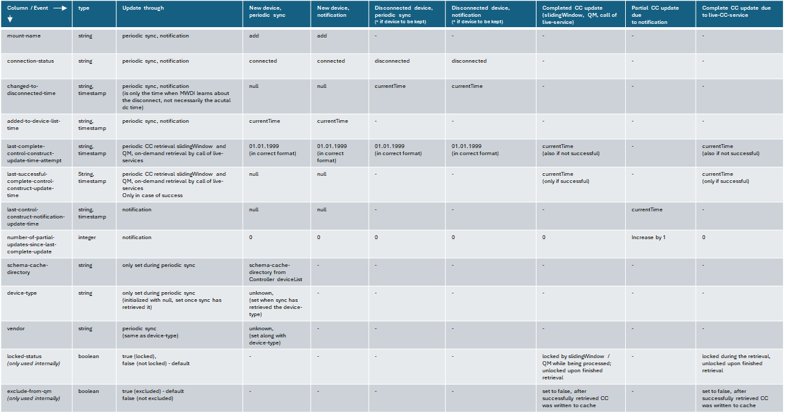

# Metadata Attributes

Below details about the metadata attributes are provided.  
These are stored along with the deviceMetadataList and are used to manage the cache update.  
The following sections describe what attributes are used, provide some information about how these attributes are filled/updated and also how they are used to sort the deviceMetadataList.

## deviceMetadataList with metadata attributes

The table shall contain the following columns:

- **mount-name**:
  - the device name
  - primary key
- **connection-status**: 
  - connection status on the controller
  - connected, connecting or unable-to-connect
- **changed-to-disconnected-time**: 
  - Indicates when the device changed (the last time) from connected state into not being connected anymore
  - Initially null; if a device changes back to connected, the timestamp is again reset to null
- **added-to-device-list-time**: 
  - the time, when the device has been initially added to the MWDI‘s deviceMetadataList
  - If a device goes into connecting or unable-to-connect state, the timestamp is not set to null, as the device shall no longer be removed from the deviceMetadataList
- **last-complete-control-construct-update-time-attempt**:
  - the last time, a complete CC update has been tried (either periodic retrieval by slidingWindow/QM or on-demand by live-service call)
  - Is set upon both successful or unsuccessful retrieval
  - Is used for retrieval prioritization
  - If the device is no longer connected, the timestamp is set to a very old data (1999, instead of null), to ensure the CC gets retrieved again with priority if the device gets connected again
- **last-successful-complete-control-construct-update-time**:
  - the last time, the CC has successfully been updated completely
  - If the device is no longer disconnected, the timestamp is kept. If the deletion policy for historical CCs is set to "keep-on-disconnect", this attributes indicates how old the CC for the disconnected device in the cache is
- **last-control-construct-notification-update-time**:
  - the last time, the CC has been updated due to a received notification (object creation/deletion or attribute value change)
  - If the device is no longer connected, the timestamp is set to null
- **number-of-partial-updates-since-last-complete-update**:
  - The number of updates caused by received notifications (object creation/deletion or attribute value change), since the CC has been updated completely the last time (i.e. since timestamp-last-complete-control-construct-update)
  - Once a complete CC update happens, the counter is reset to 0
  - If the device is no longer connected, the counter is also set to 0 
- **schema-cache-directory**:
  - This attribute contains information about the schema cache directory applied to the device at the controller
  - It indicates the device vendor, and partially also the device type.
- **device-type**:
  - this attribute contains the device type extracted from the device ControlConstruct data
  - if no mapping can be found, the value will be set to the default value "unknown"
  - it will be set initially after the device has been added to the deviceMetadataList
  - in case the device is revisited due to the periodic deviceMetadataList sync and the value is still "unknown", it again is tried to update it from CC data
- **vendor**:
  - this attribute contains the vendor and is set along with the device-type
  - if no mapping can be found, the value will be set to the default value "unknown"
  - everytime an update of an unknown device-type is tried, the vendor update will also be tried
- **locked-status**:
  - this attribute is only to be used internally
  - if a device is either added to the slidingWindow or processed by the qualityMeasurement process, it is locked
  - once it has been processed (or if it gets disconnected), the lock is released
- **exclude-from-qm**:
  - this attribute is only to be used internally
  - if a device is added to the deviceList it is set to true, only once a ControlConstruct has been written to the cache, it is set to false
  - if true, the device is not to be considered for the QM process, as there is no old ControlConstruct for comparison 
---

## Device-type and vendor retrieval

The deviceMetadataList stores the device-type and vendor of all contained mount-names.
- When the device is added to the deviceMetadataList, the device-type and vendor are initialized with their default value ("unknown")
- Due to the cyclic deviceList sync, all devices in connected state with unknown device-type are revisited and the process tries (again) to fetch the device-type and vendor for them
  - if there is no ControlConstruct for the specific device in the cache, when this is happening, the update is tried again during the next cycle and the values remain "unknown"
  - otherwise the device-type shall be dreived from the ControlConstruct data

**Where to find the information in the CC?**  
The information is to be retrieved from the air-interface-capability/type-of-equipment attribute.  
The used fields filter will not only return data that is needed, but all found ltps; the unneeded information can be ignored. 
Also a CC may contain multiple air-interfaces/type-of-equipment entries (see [issue1156](https://github.com/openBackhaul/MicroWaveDeviceInventory/issues/1156) for examples).

For finding the device-type:
- go over the found type-of-equipment attributes sequentially
- map the value of the current record against the mappings provided in *deviceTypeMapping* RegexPatternMappingProfile.
  - if no mapping other than the default "unknown" is found continue with the next record
  - if a mapping is found assign the mapped device-type, then stop - the other records do not need to be checked further
  - if all records have been checked, but still no device-type has been found the value will remain "unknown"

For mapping the vendor:
- when the device-type has been determined, determine the vendor according to the mappings provided in *vendorFromDeviceMapping*
- if the device-type is still "unknown", the vendor also remains "unknown" 

By providing the mappings in the *deviceTypeMapping* and *vendorFromDeviceMapping* profileInstances, the mappings can easily be modified, e.g. when new device types are added to the network.

---

## Sorting the deviceMetadataList

In order to effiently select the next device for ControlConstruct update by either the slidingWindow or qualityMeasurement process, the deviceMetadataList is sorted by priority.  
The ordering is based on the the *last-complete-control-construct-update-time-attempt* timestamp values, with from-oldest-to-newest order, starting with those devices where the timestamp is from *1999*.
Devices with connection-state not being *connected* are found at the end of the list (if they are being kept due to the *historicalControlConstructPolicy*).

Ordering updates:
- after successful ControlConstruct retrieval...
  - if there are only connected devices in the list: move the device to the end of the list
  - if there are also not-connected devices: move the device right in front of the first not-connected device 
- in case of failed retrievals (after the configured amount of retries):
  - move in the same fashion as for the successful retrieval
  - moving the device in the list ensures that the same device is not selected over and over again in case of failure

### Concept vs. actual implementation

According to the concept, the deviceMetadataList shall be sorted by retrieval priority, as described above.  
Due to the large number of devices in production and numerous updated device per minute, this could be not efficient and performant enough.  
Therefore in the actual implementation it would suffice, if implementers instead e.g. maintain a reduced copy of the list in memory, which just stores the mount-name, timestamp of the last complete ControlConstruct update, the locked-state in the cache and the exclude-from-pm attribute for the devices in connected state. This table in temporary memory then would be sorted on each ControlConstruct update. While starting of process cycles, both the input for the slidingWindow and qualityMeasurement would be retrieved from the in-memory table instead.

Also note, that there is no service to provide the actual complete deviceMetadataList, there is only a service to provide metadata information based on a set of devices handed over as input in the requestBody of said service. I.e. for the deviceMetadataList itself it is no problem, if it is not sorted as described above, if instead the in-memory table is used.

---

## Updating the metadata attributes

The following table gives an overview about how the metadata attributes shall be updated.  

