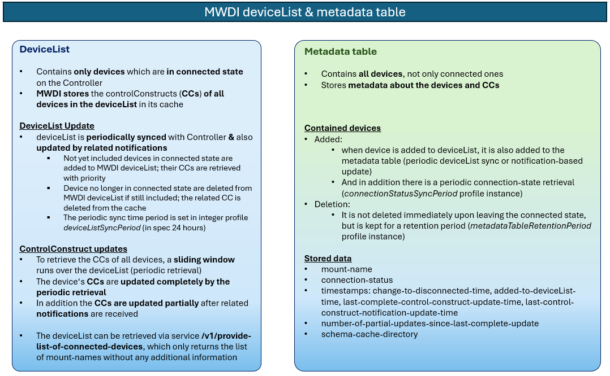
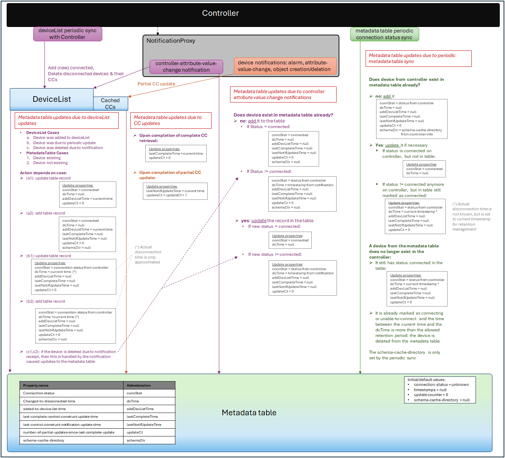
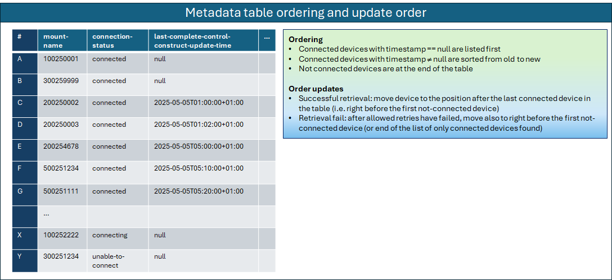

# Metadata Table Update Process

This page describes the process for updating the MWDI metadata table kept in the ElasticSearch database.  
It also describes the related profileInstances and their usage.

The metadata table is not to be confused with the MWDI's deviceList.  
- deviceList: stores only the list of currently connected devices and is used as base for retrieving device controlConstructs periodically (both for the periodic updates due to slidingWindow and the qualityMeasurement)
  - is updated according to periodic syncs with the controller
  - and through notifications about controller status changes
- metadata table: stores all devices from the controller with their connection status and additional metadata.  
  - is also update according to the deviceList periodic syncs with the controller,
  - but in addition has also an own periodic sync,
  - as well as being updated due to the controller status notifications

The following picture outlines the differences between both shortly:  

  

---
## Relevant profileInstances

The profileInstances directly relevant to the metadata table update cycle and retention are connectionStatusSyncPeriod and metadataTableRetentionPeriod.  

**`connectionStatusSyncPeriod`**
- The connection-status of all devices mounted on the controller is retrieved periodically according to the time interval specified here.
- Under normal conditions, the MWDI should receive notifications from NotificationProxy about devices changing their connection status, however notifications may be lost (e.g. due to connection errors). Therefore, a periodic sync is executed.
- After each connectionStatusSyncPeriod hours the current metadata table entries are compared against the Controller information and updated accordingly.

**`metadataTableRetentionPeriod`**
- **The retention period determines how long devices are kept in the metadata table after they have changed into a disconnected state (i.e. connecting or unable-to-connect).**
- Each time a periodic metadata table sync is executed, all devices with connection-status!=connected in the table are checked for their retention. If the duration between the current timestamp and the changed-to-disconnected-time (in days) exceeds the configured retention period, the device is deleted from the metadata table. Otherwise it is kept in the table.

---
## Metadata table contents

The table shall contain the following columns:

- **mount-name**:
  - the device name
  - primary key
- **connection-status**: 
  - connection status on the controller
  - connected, connecting or unable-to-connect
- **changed-to-disconnected-time**: 
  - Indicates when the device changed (the last time) from connected state into not being connected anymore
  - Initially null; if a device changes back to connected, the timestamp is again reset to null
- **added-to-device-list-time**: 
  - the time, when the device has been initially added to the MWDI‘s deviceList
  - If a device goes into connecting or unable-to-connect state, the timestamp is set to null, as the device shall be removed from the deviceList
- **last-complete-control-construct-update-time**:
  - the last time, the CC has been updated completely (i.e. periodic or initial retrieval)
  - If the device is no longer connected, the timestamp is set to null
- **last-control-construct-notification-update-time**:
  - the last time, the CC has been updated due to a received notification (object creation/deletion or attribute value change)
  - If the device is no longer connected, the timestamp is set to null
- **number-of-partial-updates-since-last-complete-update**:
  - The number of updates caused by received notifications (object creation/deletion or attribute value change), since the CC has been updated completely the last time (i.e. since timestamp-last-complete-control-construct-update)
  - Once a complete CC update happens, the counter is reset to 0
  - If the device is no longer connected, the counter is also set to 0 
- **schema-cache-directory**:
  - This attribute contains information about the schema cache directory applied to the device at the controller
  - It indicates the device vendor, and partially also the device type.
- **device-type**:
  - this attribute contains the device type extracted from the device ControlConstruct data
  - if no mapping can be found, the value will be set to the default value "unknown"
  - it will be set initially when the device is added to the metadata status table
  - in case the device is revisited due to the periodic sync of the metadata table and the value is still "unknown", it again is tried to update it from CC data

---
## Building and updating the metadata table

The following picture aims at providing an overview about how the metadata table is updated.  

As can be seen, the metadata table is updated due to
- deviceList updates according to the periodic deviceList sync (pink),
- periodic connection-status sync with the controller (green)
- or when there are changes to a controlConstruct  
  - from either the periodic complete controlConstruct retrieval (either by slidingWindow (pink) or qualityMeasurement (blue)),
  - or triggered by notifications
  - _note: the controlConstruct can also be updated by calling MWDI live paths_ directly _(e.g. from other applications, not as part of the qualityMeasurement process). This, however, is ignored for the metadata table update currently._

Also note that an attribute being _null_ shall be represented by an empty string. 

---

## Device-type retrieval

The metadata status table stores the device-type of all contained mount-names.
- It is to be set initially when the device is added to the metadata status table:
  - if the MWDI cache does not (yet) contain a retrieved CC for the device, the device-type is to be set to its default value "unknown",
  - otherwise the device-type shall be derived from the CC data
- If the table is updated through periodic sync the device-type shall be updated for all devices that are currently connected at the Controller and where the device-type is still "unknown".

**Where to find the information in the CC?**  
The information is to be retrieved from the air-interface-capability/type-of-equipment attribute.  
The used fields filter will not only return data that is needed, but all found ltps; the unneeded information can be ignored. 
Also a CC may contain multiple air-interfaces/type-of-equipment entries (see [issue1156](https://github.com/openBackhaul/MicroWaveDeviceInventory/issues/1156) for examples).

For finding the device-type:
- go over the found type-of-equipment attributes sequentially
- map the value of the current record against the mappings provided in *deviceTypeMapping* RegexPatternMappingProfile.
  - if no mapping other than the default "unknown" is found continue with the next record
  - if a mapping is found assign the mapped device-type, then stop - the other records do not need to be checked further
  - if all records have been checked, but still no device-type has been found the value will remain "unknown"

By providing the mappings in the *deviceTypeMapping* profileInstance, the mappings can easily be modified, e.g. when new device types are added to the network.

---

## Filtering of metadata

There are two options for data retrieval. The filter is mandatory and provided in the requestBody:
- **_MountNameList_**: when the service is called, a mount-name list can be handed over as input.
  - The metadata table data is filtered for devices found in the list.
  - Data for other devices is not returned.
- **_TimestampFilter_**: the 2nd option is a filter on the *last-complete-control-construct-update-time* property.
  - It shall return an output list with only a single device record (if found).
  - Only devices in *connected* state are to be considered.
  - Depending on the provided value, the data shall be filtered for the device with:
    - the oldest, not-null timestamp value: this will be used for the quality measurements
    - or for the oldest or null timestamp value (if there are multiple devices with null timestamps, take the first one found): this is to be used for the regular cyclic CC updates (slidingWindow process)

## Sorting the metadata table

In order to efficiently allow for filtering on the *last-complete-control-construct-update-time* timestamp values, the devices in the metadata table should be ordered accordingly.  
The devices shall be ordered according to the timestamp value, in from-oldest-to-newest order. Starting with those devices where the timestamp is *null* (as those shall be updated with priority).

Ordering updates:
- after successful ControlConstruct retrieval...
  - if there are only connected devices in the table: move the device at the end of the table
  - if there are also not-connected devices: move the device right in front of the first not-connected device 
- in case of failed retrievals (after the configured amount of retries):
  - move in the same fashion as for the successful retrieval
  - moving the device in the table ensures that the same device is not selected over and over again in case of failure

