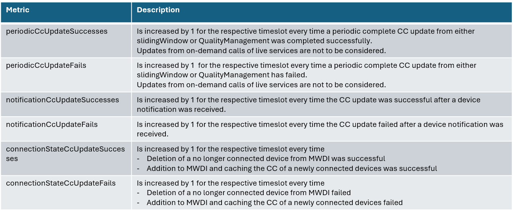

# Status Reporting

MWDI shall collect status data about regularly carried out updates on its cache to support its operation.  
The data will be gathered as described below made available by a dedicated service.  

## Status metrics

The metrics count how often ControlConstruct updates were successful or failed
- for specific events
- across all devices
- aggregated per hour for a configurable number of hours

The events and related metrics are
1. periodic CC update by either slidingWindow or qualityMeasurement
   - periodicCcUpdateSuccesses
   - periodicCcUpdateFails
2. CC update based on device notifications
   - notificationCcUpdateSuccesses
   - notificationCcUpdateFails
3. changed connection status of devices (from connected to another state or vice versa)
   - connectionStateCcUpdateSuccesses
   - connectionStateCcUpdateFails

**Metric arrays**

- The implementation maintains metric values for the most recent *n* hours, where *n* is configurable.
- *Timeslot*: Metrics are associated with a timeslot identified by the combination of date and hour. For example, for `2010-11-20T14:00:00+01:00` the timeslot key is `2010-11-20T14`.
- When a new hour begins, a rollover occurs: data older than the configured retention period is discarded and a new timeslot for the current hour is created.
- Metric values for a new timeslot are initialized with `0` and incremented when the associated events occur.
- The metrics are gathered across all devices.
- The internal storage format is implementation-specific (i.e. up to the implementer).
- For API output, the data SHALL be provided in a flattened format, consisting of an array of timeslot entries. Each entry contains the timeslot identifier and the values of all metrics for that timeslot.

**Metrics and update events**  

The table outlines when the different metrics are to be updated.  

