# MicroWaveDeviceInventory Diagrams
.  
.  
  
.  
.  
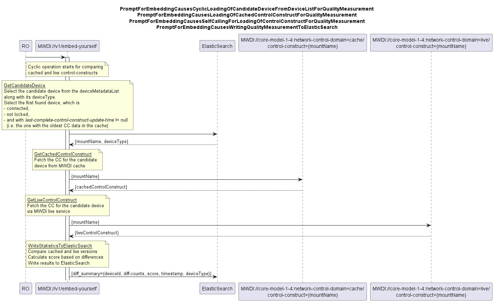
.  
.  
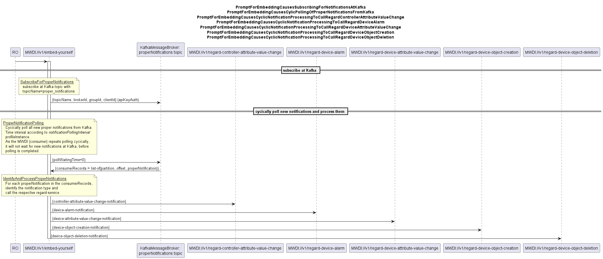  
.  
.  
  
.  
.  
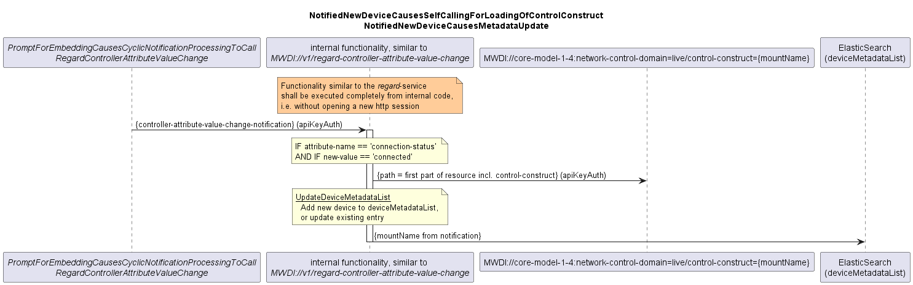  
.  
.  
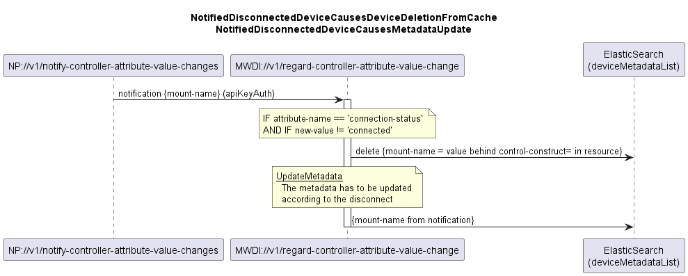  
.  
.  
  
.  
.  
  
.  
.  
  
.  
.  
  
.  
.  
  
.  
.  
  
.  
.  
  
.  
.  
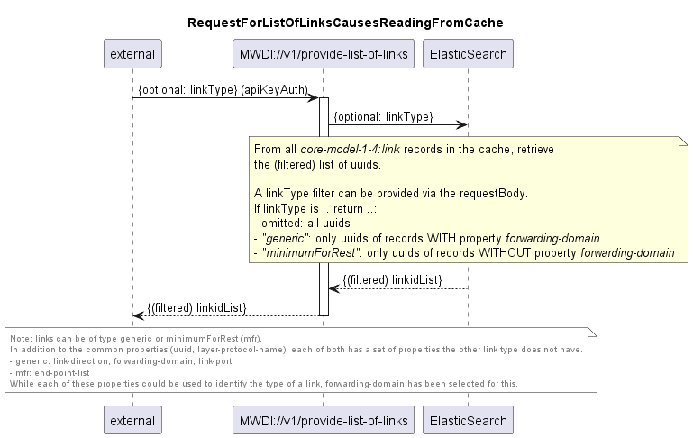
.  
.  
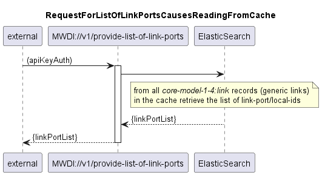
.  
.  

.  
.  
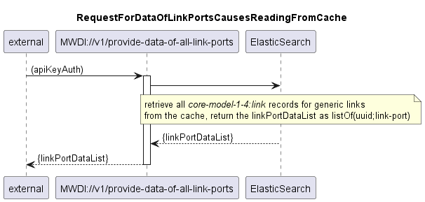
.  
.  
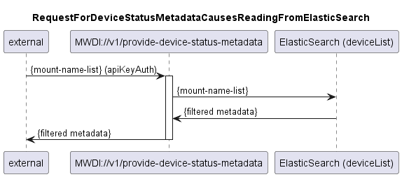
.  
.  
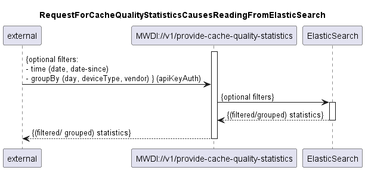
.  
.  
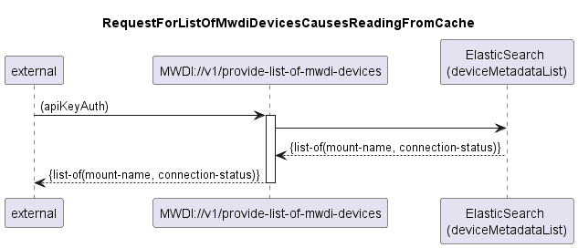
.  
.  
  
.  
.  
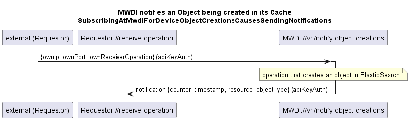  
.  
.  
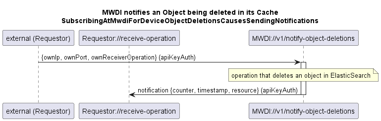  
.  
.  
  
.  
.  
  
.  
.  
