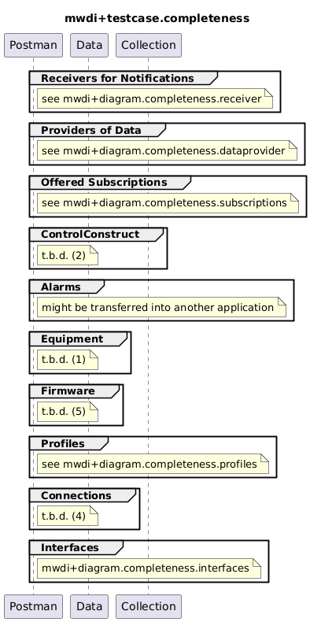

# Functional Testing of Completeness

## General

### Targets
- All individual services

### Criteria
- ResponseCode 204 OR 200 with ResponseBody according to the definitions in the OAS

### Comments  
- Need for Updates:  
  - Services paths (e.g. /v1/provide-list-of-links) depend on the release of the application  
  - Ressource paths (e.g. /core-model-1-4:network-control-domain=cache/control-construct={mountName}) might depend on the release of the management interface  
- Testing of Ressource Paths:  
  - Controller/mediator/device gets addressed first to prevent the MWDI testing to fail in case the mediator is faulty  
  - Live domain gets addressed next to assure the MWDI to cache the information requested afterwards

## MWDI v1.2.2  
- TestCaseCollection for testing Completeness is split, because of very high number of paths  
  - [Receivers of Notifications](./v1.2.2/Receiver/)  
  - [Providers of Data](./v1.2.2/Dataprovider/)  
  - [Offered Subscriptions](./v1.2.2/Subscriptions/)  
  - [CacheEnrichment](./v1/2.2/CacheEnrichement)  
  - [ControlConstruct](./v1.2.2/CC/)  
  - [Alarms](./v1.2.2/Alarms/)  
  - [Equipment](./v1.2.2/Equipment/)  
  - [Firmware](./v1.2.2/Firmware/)  
  - [Profiles](./v1.2.2/Profiles/)  
  - [Connections](./v1.2.2/Connections/)  
  - [Interfaces](./v1.2.2/Interfaces/)  

  

