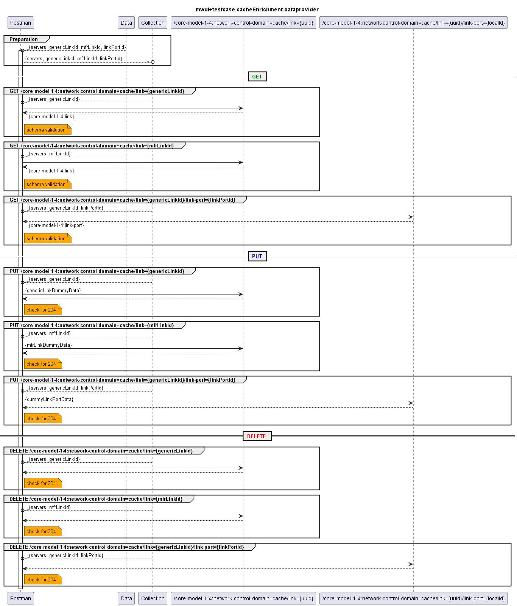

# Functional Testing of Completeness of the Cache Enrichment  

  

Cache enrichment adds (topology) information to the MWDI cache. Contrary to the other cache and live ressource paths this data is not coming from the devices, but has to be added by other (not yet existing) applications.  

Currently the enrichment ressource paths only cover the following objects:
- link
- link-port