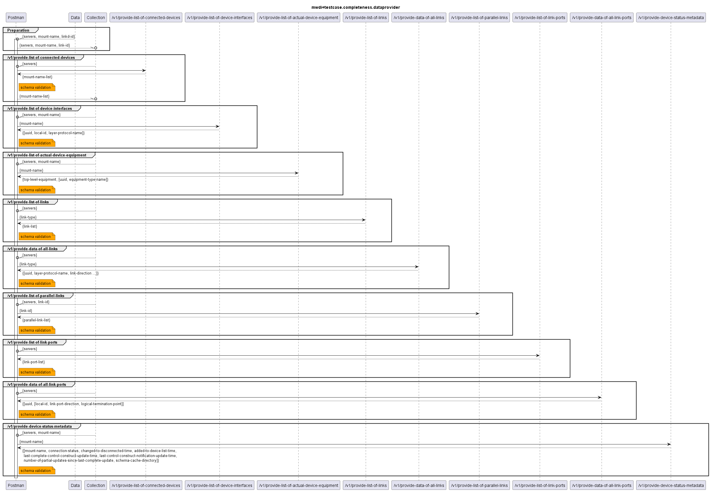

# Functional Testing of Completeness of the Providers of Data  

  

The following list contains the services from the above diagram, for which completness tests are provided.  
The list gives some information about testing limitations (currently this applies only for the link-related services):   
- /v1/provide-list-of-connected-devices
- /v1/provide-list-of-device-interfaces
- /v1/provide-list-of-actual-device-equipment
- /v1/provide-list-of-links:
  - an optional filter for the link type can be provided in the requestBody upon call (link-type = "minimumForRest" or "generic")
  - the service returns only a list of linkIDs, without any information about the link type
  - therefore, the completeness test will just test of a list of linkIDs is returned according to the specified response schema, but the test will not include any checks for the link-type
- /v1/provide-data-of-all-links
  - links can be of type "minimumForRest" or "generic"
  - the schemas for both link-types are different from another (i.e. they contain partially different attributes)
  - the service has an optional requestBody, where a link-type filter can be provided
    - if no filter is provided, the returned list shall contain data for all links, i.e. depending on the cache content there can be links of both link-types
    - if a filter is provided, the returned list shall just contain data for the desired link-type 
  - the completeness test only covers the case that no requestBody is provided
    - the (static) [simulator](./simulators/MicroWaveDeviceInventory+simu.yaml) for the [completeness testcase collection](mwdi+data.completeness.json) provided can only handle one link-type at once, as the link-type is not part of the path
    - therefore, the additional tests for filtering are provided as an own Postman collection, with separate simulators per link type
      - see simulators [genericLink](./simulators/MicroWaveDeviceInventory+simu.linkGeneric.yaml) and [mfrLink](./simulators/MicroWaveDeviceInventory+simu.linkMfr.yaml)
      - which are to be used with separate testcase collections for [genericLink](mwdi+data.completeness.linkGeneric.json) and [mfrLink](mwdi+data.completeness.linkMfr.json)
- /v1/provide-list-of-parallel-links
- /v1/provide-list-of-link-ports
- /v1/provide-data-of-all-link-ports
- /v1/provide-device-status-metadata
