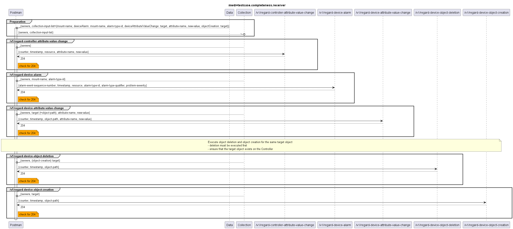

# Functional Testing of Completeness of the Receivers of Notifications

  

Note that when the services under test are normally called by NotificationProxy to trigger an update in the MWDI cache.  
The input values for the attributes in the requestBodies need to be chosen carefully. The dataFile allows to add sufficient parameters for the tests. 
Some limitations and things to be aware of listed below:
- `/v1/regard-controller-attribute-value-change`
  - indicates that a device has changed its connection state at the Controller
  - test can be called with a dummy mount name as input (so there will be no actual change on the MWDI cache)
- `/v1/regard-device-alarm`
- `/v1/regard-device-attribute-value-change`
  - this directly changes an attribute value inside the MWDI cache: ensure to not overwrite the attribute-value by providing the current attribute-value for the selected target in the dataFile
  - A valid combination of mountName and object-path needs to be chosen, i.e. an unknown combination of mountName/ltp-uuid leads to an error
- `/v1/regard-device-object-creation`
  - the target object MUST exist in the device, otherwise the creation will fail as the related object data is read from the device via the controller (which will return a 409 if the object is not found in the device)
- `/v1/regard-device-object-deletion`
  - this deletes an existing object from the device data
  - the ordering in the testcase collection is as follows:
    1. delete the object via /v1/regard-device-object-deletion
    2. then re-create it via /v1/regard-device-object-creation
---

Additional notes:
- All of the above regard-services answer with 204 in case of success, i.e. without response body.
- The dataFile contains the entries "serverToBeApplied" and "controllerToBeApplied". For now only serverToBeApplied is required. The controller would be queried if an regard-operation on MWDI is called, which would require the MWDI to fetch data from the Controller. However, this is done within a callback and thus, encapsulated. The controllerToBeApplied however could be added as an information to reflect with which Controller the MWDI is connected. It is kept for now, but may be removed later on. 
