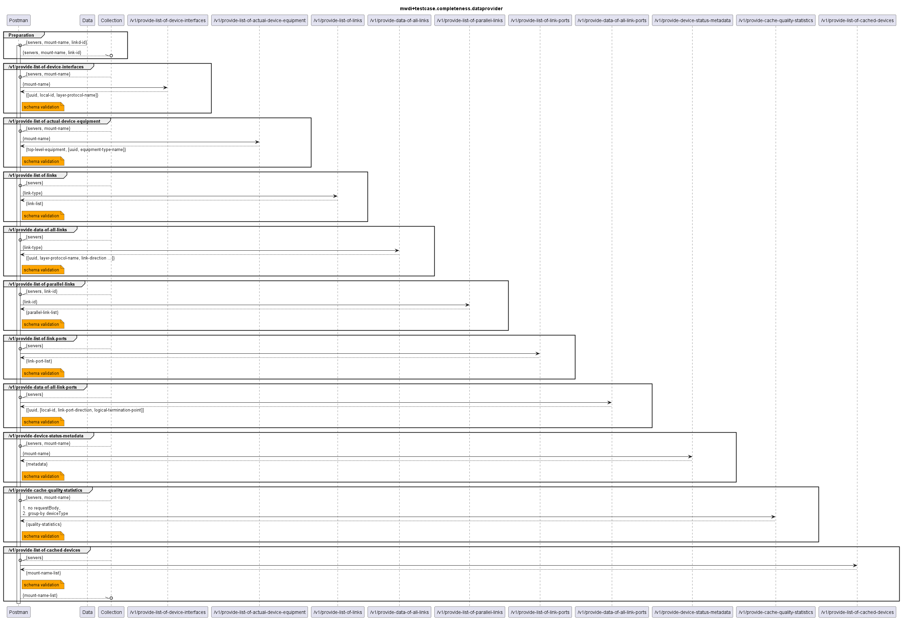

# Functional Testing of Completeness of the Providers of Data  

  

The following list contains the services from the above diagram, for which completness tests are provided.  
The list gives some information about testing limitations (currently this applies only for the link-related services):   
- /v1/provide-list-of-device-interfaces
- /v1/provide-list-of-actual-device-equipment
- /v1/provide-list-of-links:
  - an optional filter for the link type can be provided in the requestBody upon call (link-type = "minimumForRest" or "generic")
  - the service returns only a list of linkIDs, without any information about the link type
  - therefore, the completeness test will just test of a list of linkIDs is returned according to the specified response schema, but the test will not include any checks for the link-type
- /v1/provide-data-of-all-links
  - links can be of type "minimumForRest" or "generic", and the response schemas for both types differ
  - the service has an optional requestBody to filter for the link type, but the basic completeness test calls the service without any requestBody, therefore the service shall return data for all found links leading to the response possibly containing links from both types
  - dedicated tests for the link type filtering are out of scope of the basic completeness test
- /v1/provide-list-of-parallel-links
- /v1/provide-list-of-link-ports
- /v1/provide-data-of-all-link-ports
- /v1/provide-device-status-metadata
- /v1/provide-cache-quality-statistics
  - and optional filter for the link type can be provided in the requestBody upon call
  - the completeness test will be executed without providing the optional filter
- /v1/provide-list-of-cached-devices

---

Note on link and linkport services:  
The link and linkport data is not read from devices, but has to be written to MWDI by an additional application, which currently does not exist.  
Therefore the related services will not return any data, unless testers add testdata manually to the MWDI cache!

*Additional note*:  
*The examples for the complete service responses (for services under test) should have the same identation as the* schema *keyword*.  
*However, if the simulators are created from the OAS accordingly, the import in Mockoon will lead to empty examples, altough the examples are shown correctly in the Swagger editor.*
*Therefore, it was necessary to change the identation of response examples in the simulators to match the identation of the* properties *keyword.*

### Deprecated services

The below diagram shows the deprecated services, for which the related testcase collection can be found in the subfolder *_deprecated-services tests*.  

