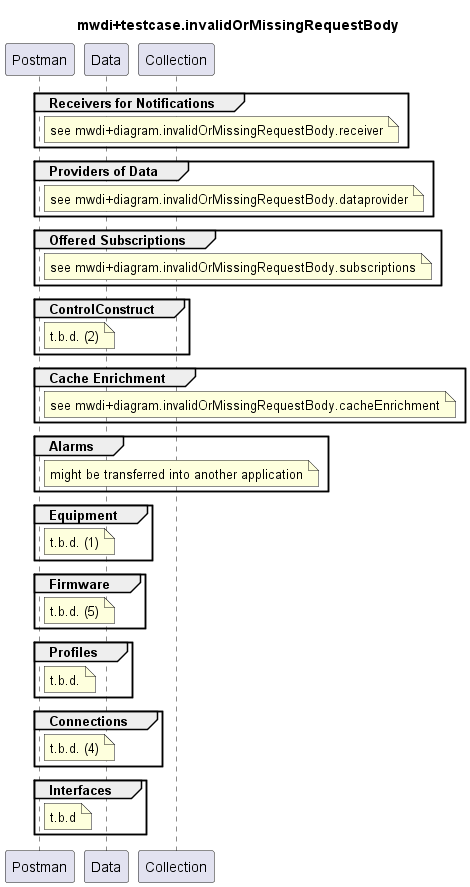

# Functional Testing of Invalid or Missing RequestBody Handling

## General

### Targets
- All individual services

### Criteria
- ResponseCode 400:
  - required requestBody is provided, but does follow the definitions in the OAS
    - i.e. required attributes are missing
    - and/or the schema structure is not met
    - note that additional attributes not listed in the OAS are simply ignored and do make the requestBody invalid unless the OAS explicitly forbidds them (*additionalProperties=false* statement) 
  - required requestBody is missing
    - note that with MWDI_1.1.x this lead to a 415
    - starting with MWDI_1.2.x this shall also return a 400
- ResponseCode 200/204:
  - no requestBody is specified in the OAS, but a is provided when a request is called: the provided requestBody is simply ignored

### Comments  
- Need for Updates:  
  - Services paths (e.g. /v1/provide-list-of-links) depend on the release of the application  
  - Ressource paths (e.g. /core-model-1-4:network-control-domain=cache/control-construct={mountName}) might depend on the release of the management interface  
- Testing of Ressource Paths:  
  - Controller/mediator/device gets addressed first to prevent the MWDI testing to fail in case the mediator is faulty  
  - Live domain gets addressed next to assure the MWDI to cache the information requested afterwards

## MWDI v1.2.2  
- TestCaseCollection for testing invalid or missing requestBody responses is split, because of very high number of paths  
  - [Receivers of Notifications](./v1.2.2/Receiver/)  
  - [Providers of Data](./v1.2.2/Dataprovider/)  
  - [Offered Subscriptions](./v1.2.2/Subscriptions/)  
  - [Cache Enrichment](./v1.2.2/CacheEnrichment)  
  - not yet existing:
    - [ControlConstruct]  
    - [Alarms]  
    - [Equipment]  
    - [Firmware]  
    - [Profiles]  
    - [Connections]  
    - [Interfaces]  

  

