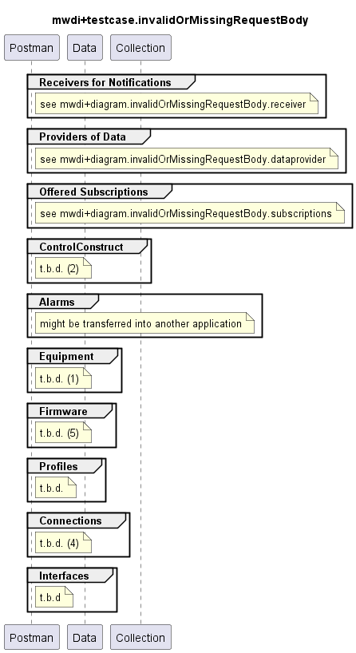

# Functional Testing of Invalid or Missing RequestBody Handling

## General

### Targets
- All individual services

### Criteria
- ResponseCode 400 with ResponseBody not according to the definitions in the OAS or missing completely
  - note that where the schemas do not contain an *additionalProperties=false* statement, additional attributes in the requestBody are simply ignored (i.e. the requestBody does not become invalid by adding additional attributes)
  - also note that in MWDI_1.1.x, a required, but missing requestBody lead to a 415 - starting with MWDI_1.2.x, a 400 shall also be returned for that case
- special case: for services without a specified requestBody in the OAS, a provided requestBody can just be ignored instead of returning a 400. I.e. the service then should return a 200 or 204.

### Comments  
- Need for Updates:  
  - Services paths (e.g. /v1/provide-list-of-links) depend on the release of the application  
  - Ressource paths (e.g. /core-model-1-4:network-control-domain=cache/control-construct={mountName}) might depend on the release of the management interface  
- Testing of Ressource Paths:  
  - Controller/mediator/device gets addressed first to prevent the MWDI testing to fail in case the mediator is faulty  
  - Live domain gets addressed next to assure the MWDI to cache the information requested afterwards

## MWDI v1.2.2  
- TestCaseCollection for testing invalid or missing requestBody responses is split, because of very high number of paths  
  - [Receivers of Notifications](./v1.2.2/Receiver/)  
  - [Providers of Data](./v1.2.2/Dataprovider/)  
  - [Offered Subscriptions](./v1.2.2/Subscriptions/)  
  - not yet existing:
    - [ControlConstruct]  
    - [Alarms]  
    - [Equipment]  
    - [Firmware]  
    - [Profiles]  
    - [Connections]  
    - [Interfaces]  

  

