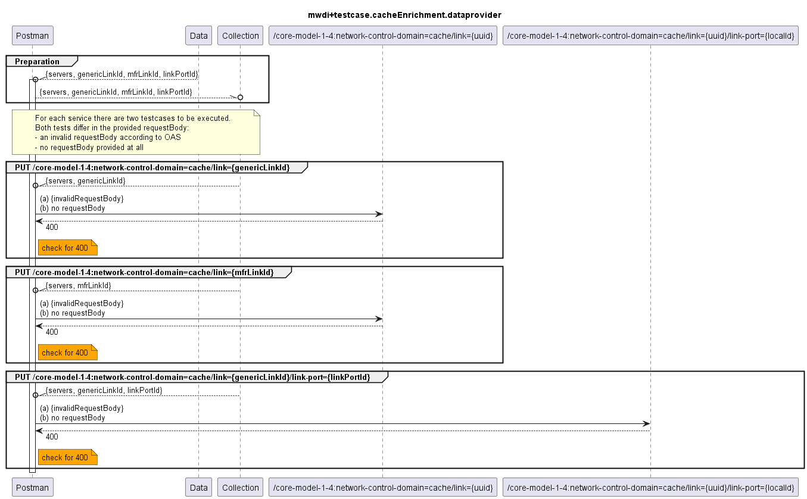

# Functional Testing the Handling of invalid or missing requestBodies for the Cache Enrichment  

  

Currently the enrichment ressource paths only cover the following objects:
- link
- link-port

The offered services provide GET, PUT, DELETE operations. A requestBody is only required for the PUT operations.