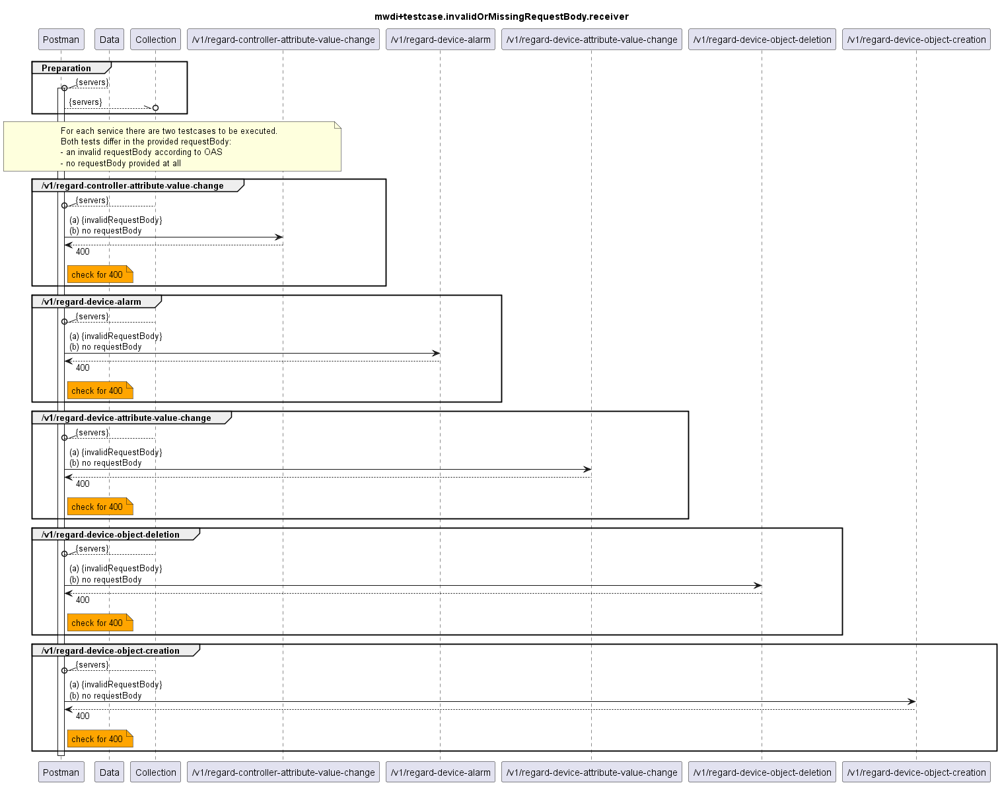

# Functional Testing of Invalid or Missing RequestBody Handling of the Receivers of Notifications

  

For the receiver services the OAS contains a requestBody. The tests therefore are executed with both an invalid requestBody and with a missing requestBody. In all cases a 400 response is expected. 