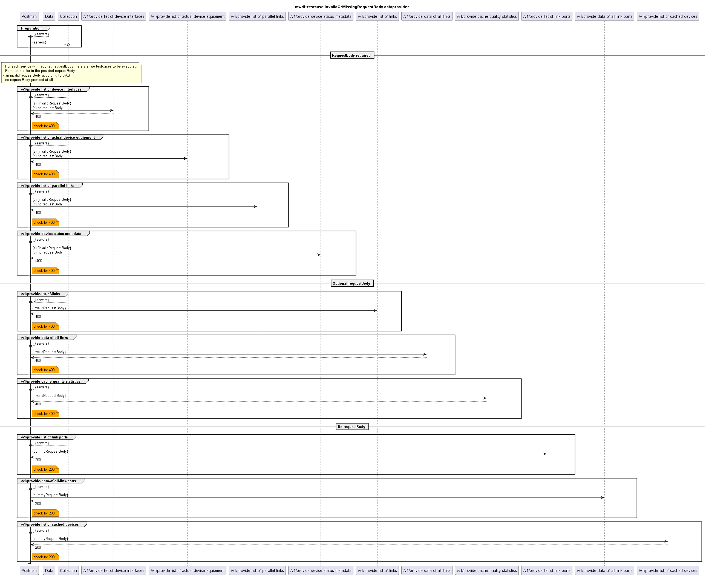

# Functional Testing of Invalid or Missing RequestBody Handling of the Providers of Data  

  

Not all of the tested services require a requestBody.  
The tested services can be categorized into three groups:
- (1) services, where the requestBody is mandatory and must be provided according to the schema from the OAS.
    - for these services two test will be performed: a) an invalid requestBody is provided and b) no requestBody is provided
  - in both cases a 400 shall be returned
- (2) services, where the requestBody is optional: if provided, it must match the OAS
  - these services will be tested with an invalid requestBody
  - a 400 shall be returned
- (3) services, where no requestBody is specified.
  - these services will be tested with a dummy requestBody (as none is specified, any requestBody will do)
  - a 200 shall be returned  

---
The respective services per category are:  
|  requestBody category |  Services |  Tests, expected results |
|---|---|---|
|  (1) mandatory |/v1/provide-list-of-device-interfaces  /v1/provide-list-of-actual-device-equipment  /v1/provide-list-of-parallel-links  /v1/provide-device-status-metadata   |  Invalid requestBody, no requestBody  400 |
|  (2) optional |   /v1/provide-list-of-links   /v1/provide-data-of-all-links |  Invalid requestBody,  400 |
|  (3) none |   /v1/provide-list-of-connected-devices   /v1/provide-list-of-link-ports   /v1/provide-data-of-all-link-ports |  Dummy requestBody  200 |