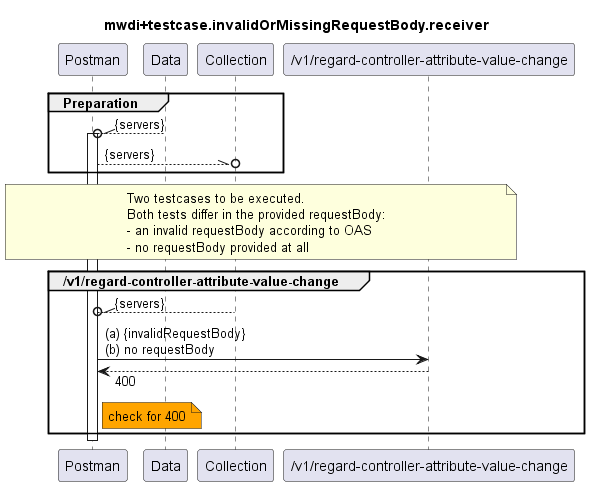

# Functional Testing of Invalid or Missing RequestBody Handling of the Receivers of Notifications

For the receiver services the OAS contains a requestBody. The tests therefore are executed with both an invalid requestBody and with a missing requestBody. In all cases a 400 response is expected. 

Note: 
- The *regard*-services for device and alarm notifications have been deprecated with MWDI v2.0.0.
- The *regard*-service for controller notifications however remains in use.
- The testcase collections therefore have been splitted.

  

**Deprecated services**  
  
