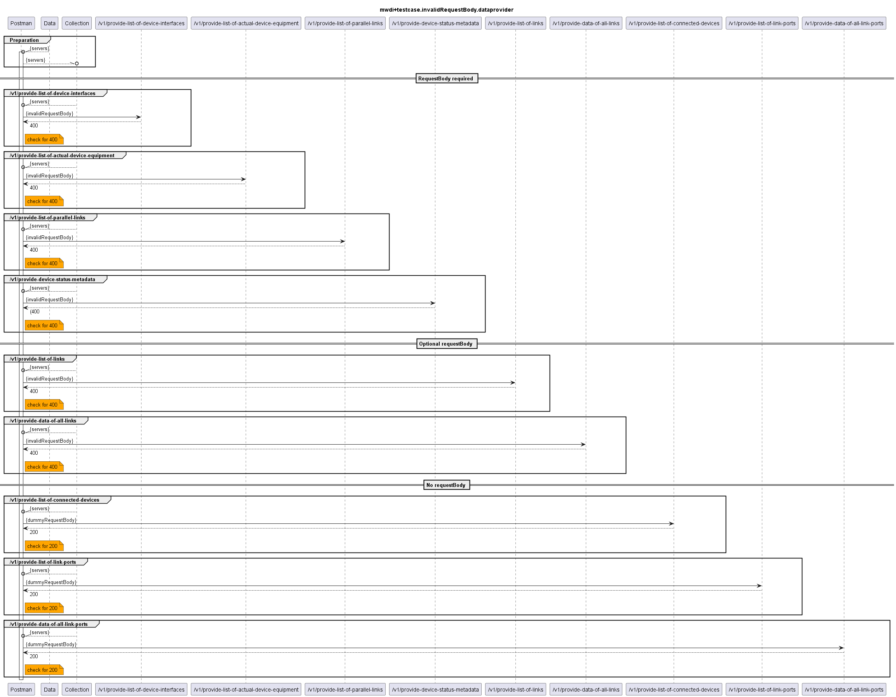

# Functional Testing of Invalid RequestBody Handling of the Providers of Data  

  

A requestBody is not mandatory for all services.
- optional requestBody: if provided, it must be according to the OAS. The tests will be executed with a requestBody that does not conform to the OAS, i.e. the expected response is 400.
  - /v1/provide-list-of-links
  - /v1/provide-data-of-all-links
- no requestBody expected: if no requestBody is specified. For the tests, a dummy requestBody is handed over. The services could either respond with an error, or the requestBody can simply be ignored. For this scenario, the services are expected to ignore the requestBody and respond normally, i.e. with 200.
  - /v1/provide-list-of-connected-devices
  - /v1/provide-list-of-link-ports
  - /v1/provide-data-of-all-link-ports