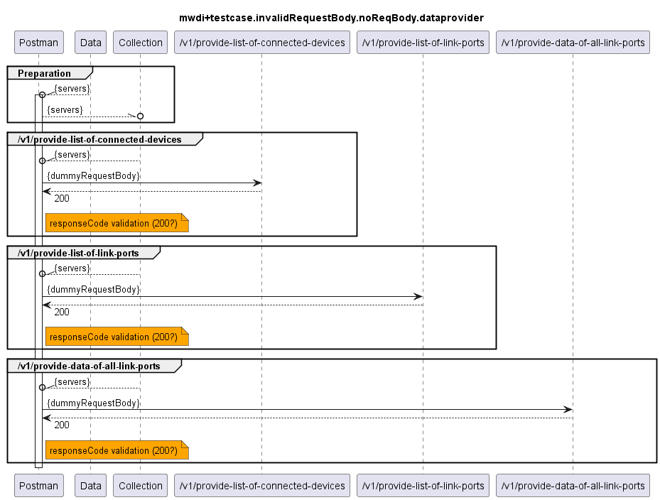
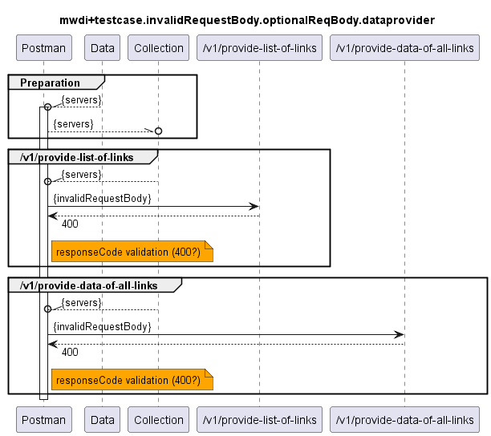
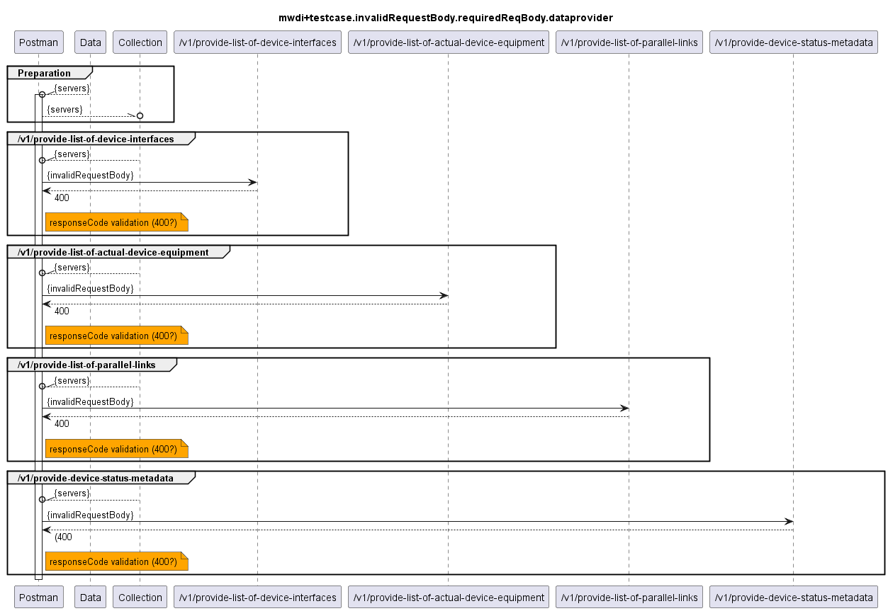

# Functional Testing of Invalid RequestBody Handling of the Providers of Data  

  
  
  

The following services do not expect a requestBody according to the OAS, i.e. an provided requestBody shall simply be ignored (service shall return a 200). For testing the services will be called with a dummy requestBody:
- /v1/provide-list-of-connected-devices
- /v1/provide-list-of-link-ports
- /v1/provide-data-of-all-link-ports

The following services can optionally be called with a requestBody. If a requestBody is provided, it must be according to the OAS. The tests will be executed with a requestBody not following the specification, i.e. shall be answered with a 400:
- /v1/provide-list-of-links
- /v1/provide-data-of-all-links
