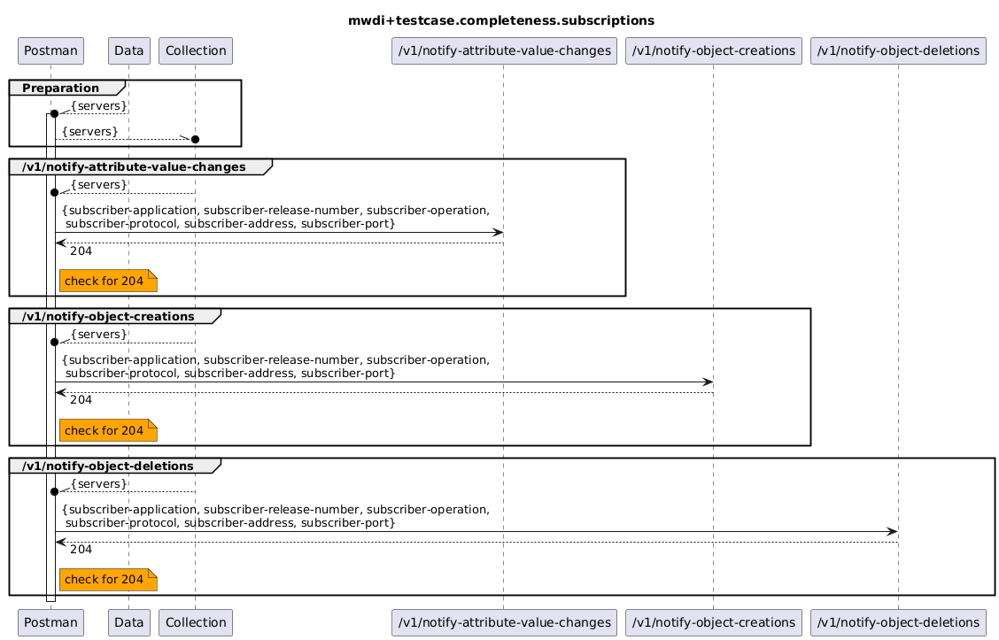

# Functional Testing of Completeness of offered Subscriptions  

  

Note:  
Then the *notify* services are called by subscribers to subscribe for receiving notifications from MWDI, 
the subscribers must hand over their contact information (e.g. ip, port and their receive operation) in the requestBody of the request.  
As in this testcase collection it only shall be tested, whether the services correctly return a 204 and not the receipt of notifications or anything else, it is sufficient to not provide parametrized subscriber  
information (i.e. if parametrization would have been required,  the related parameters would have been included in the datafile).

