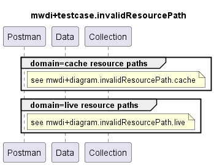

# Functional Testing of invalid resource paths

## General
These testcase collections are testing MWDI responses for invalid resource paths

### Targets
- All device resource paths services (link and link-port are out-of-scope)
  - cache=domain
  - cache=live

### Criteria
ResponseCode for 
- (a) cache=domain paths with invalid mount-name
  - 460
  - example: /core-model-1-4:network-control-domain=cache/control-construct={mountName} 
- (b) cache=domain paths with valid mount-name, but invalid other path parameters
  - 470
  - example: /core-model-1-4:network-control-domain=cache/control-construct={mountName}/equipment={uuid}/actual-equipment
- (c) cache=live paths: todo

### Comments  

## MWDI v2.0.1  
- TestCaseCollection for testing is split  
  - [cache](./v2.0.1/cache/)  
  - [live](./v2.0.1/live/)  

  

