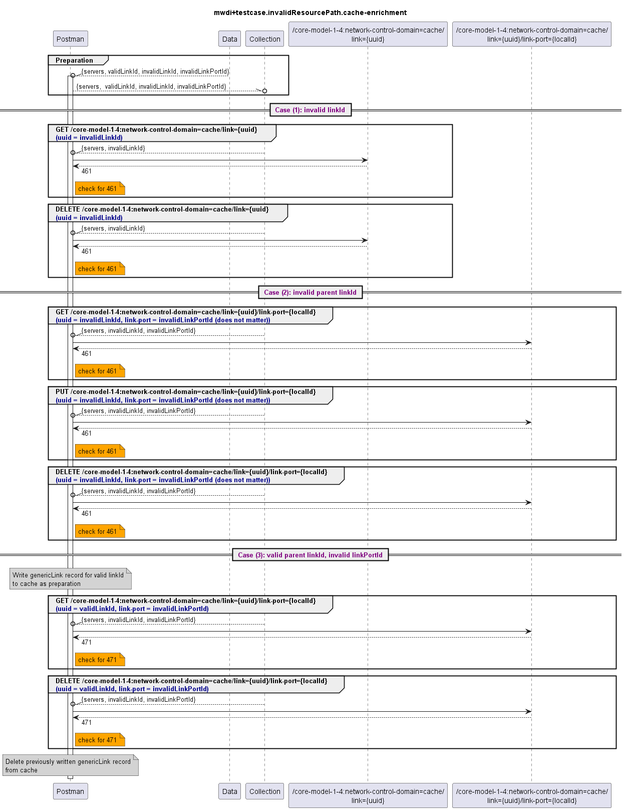

# Functional Testing of invalid resource paths for link and linkport

  

Expected responseCodes are as follows:

| path category                   | case                                    | expected responseCode |
|---------------------------------|-----------------------------------------|-----------------------|
| (1) cache=domain/link           | invalid linkId                          | 461                   |
| (2) cache=domain/link/link-port | invalid parent linkId                   | 461                   |
| (3) cache=domain/link/link-port | valid parent linkId, invalid linkPortId | 471                   |

Note:  
- link and link-port resource paths support GET, PUT and DELETE, but not all combinations need to be tested
  - case (1): GET, DELETE
  - case (2): GET, PUT, DELETE
  - case (3): GET, DELETE
- link and link-port data is enrichment data, hence they will not be populated automatically from device data
  - tests for case (1) can be executed right away, as there are no prerequisites
  - tests for case (3) require a valid linkId already to be present in the database before the actual tests can be executed
    - this could be achieved by population the database beforehand
    - this testcase collection attempts to write a linkId record to the database before the tests are executed 