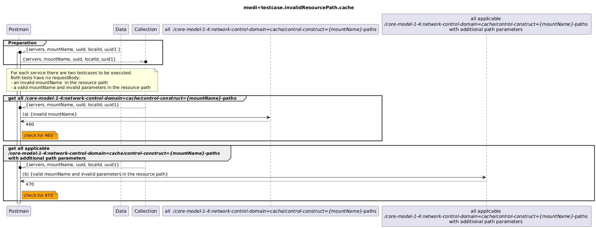

# Functional Testing of invalid resource paths for domain=cache paths

  

Expected responseCodes for cache resource paths differ from expected responseCodes from live paths:

| Case                                                  | Controller response | expected code: cache | expected code: live |
|-------------------------------------------------------|---------------------|----------------------|---------------------|
| (1) invalid mount-name                                | 503                 | 460                  | 503                 |
| (2) valid mount-name, invalid other path parameters   | 409                 | 470                  | 502                 |

Note that:  
- only device-related resource paths are tested here (i.e. link and linkport paths, which are just enrichment are out of scope)
- not all resource paths from case (1) need to be tested for case (2), as not all of those resource paths do contain path parameters apart from the mount-name