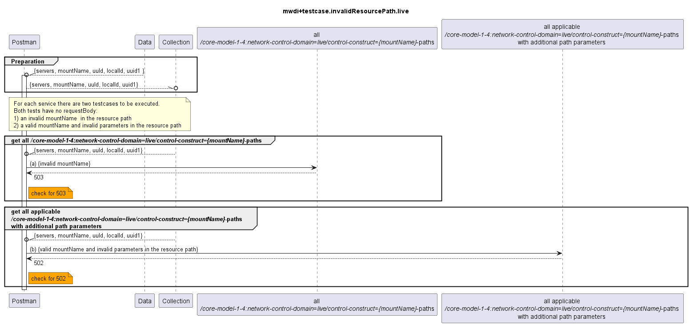

# Functional Testing of invalid resource paths for domain=live paths

  

Expected responseCodes for cache resource paths differ from expected responseCodes from live paths:

| Case                                              | Controller response | expected code: cache | expected code: live |
|---------------------------------------------------|---------------------|----------------------|---------------------|
| invalid mount-name                                | 503                 | 460                  | 503                 |
| valid mount-name, invalid other path   parameters | 409                 | 470                  | 502                 |