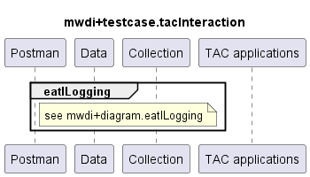

# Functional Testing of TAC interaction

## General
These testcase collections are testing MWDI interaction with TAC

## Test scenarios
MWDI interacts with TAC in a couple of different ways. The different scenarios are separated into different subfolders.  
Currently the following scenarios are covered:  
- EATL logging: check that records are being sent to EATL consequently

Other possibly relevant scenarios not yet covered:  
- Application properly registered at RegistryOffice (RO)
- Application works together properly with RO

### Comments  

## MWDI v2.0.1  
- TestCaseCollection for testing is split  
  - [eatlLogging](./v2.0.1/eatlLogging/)  

  

---

### Background - EATL

**ExecutionAndTraceLog**
ExecutionAndTraceLog (EATL) is logging all service activities.
 
**What is the purpose of ExecutionAndTraceLog?**
The EATL logs information about all service requests.
It provides services to e.g. retrieve the following information:
 - a list of all service records
 - a list of all service records beloning to the same flow
 - a list of unsuccessful service requests

**How does EATL help to troubleshoot a failed/successful end to end flow?**
With the provided services the complete communication flow between applications can be made availably for analysis.
Each service request record includes detailed information about the executed requests, such as originator, application name and release, operation name, response code and the timestamp.
It also includes the x-correlator and trace-indicator, which help to group requests associated with each other.
E.g. by first requesting the list of unsuccessful requests, problematic requests can be identified.
By then retrieving all service request records belonging to the same flow as the problem request further analysis is possible.