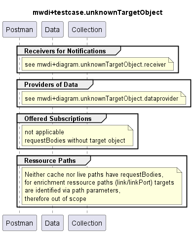

# Functional Testing of Unknown Target Object (in RequestBody) Handling

## General
With introduction of MWDI_1.2.x, error codes have been harmonized.  
This testcase collection tests whether the tested services reply according to the harmonized prescriptions.  
**Target object** refers to input objects like mountName, link or linkPort **provided in the requestBody**.  
If objects like mountName are provided in the ressource path instead, they are referred to as ressources in the context of testcase collections.
Therefore, this testcase collection does not apply to the ressource paths, but only to receivers, dataproviders and subscriptions.

### Targets
All individual services
- that are not ressource paths
- and with a requestBody containing target objects like e.g. mountName

### Criteria
- **Input target objects in the requestBody**:
  - *mountName*: if the mountName is unknown, i.e. not found in the list of connected devices: 460
  - *link*: if link is unknown: 461
  - *linkPort*:
    - if the parent link is unknown: 461
    - if the parent link is known: 471
  - special case: received notifications
    - *resource* or *objectPath* with unknown IDs: 470 (TODO: check!)  

### Comments  
- Need for Updates:  
  - Services paths (e.g. /v1/provide-list-of-links) depend on the release of the application  
  - Ressource paths (e.g. /core-model-1-4:network-control-domain=cache/control-construct={mountName}) might depend on the release of the management interface  
- Testing of Ressource Paths:  
  - Controller/mediator/device gets addressed first to prevent the MWDI testing to fail in case the mediator is faulty  
  - Live domain gets addressed next to assure the MWDI to cache the information requested afterwards

### Scope
- This testcase collection only tests if unknown input targets (e.g. mountName, link, linkport) in the requestBody are handled correctly
  - therefore services without requestBody are out of testing scope (all cache and live ressource paths handling device data)
  - ressource paths to handle enrichment data (i.e. data that is written to MWDI cache from other sources than device data) with requestBodies are within the scope (this applies to link and link-port services)
- Unknown input objects in the path parameters of ressource paths (e.g. combinations of mountName, uuid, localId) are not within the scope of this testcase collection

## MWDI v1.2.2  
- TestCaseCollection is split into the following sections:  
  - [Receivers of Notifications](./v1.2.2/Receiver/)  
  - [Providers of Data](./v1.2.2/Dataprovider/)  
  - Cache enrichment:
    - [Link Cache](./v1.2.2/LinkCache)
  - out of scope (no requestBody):
      - [Offered Subscriptions]  
      - [ControlConstruct]
      - [Alarms]  
      - [Equipment]  
      - [Firmware]  
      - [Profiles]  
      - [Connections]  
      - [Interfaces]  

  

