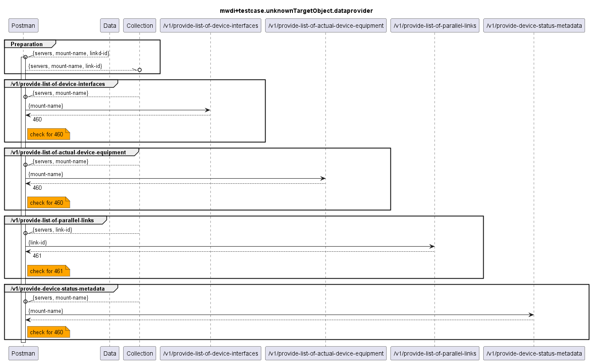

# Functional Testing of Unknown Target Object (in RequestBody) Handling of the Providers of Data  

  

Services are not tested here, if they either do not have a requestBody or if the requestBody does not contain properties for target object filtering.  
This applies to the following services:  
- /v1/provide-list-of-links
- /v1/provide-data-of-all-links
- /v1/provide-list-of-link-ports
- /v1/provide-list-of-link-ports
- /v1/provide-data-of-all-link-ports
- /v1/provide-list-of-cached-devices  

and also:
- /v1/provide-list-of-connected-devices (deprecated)