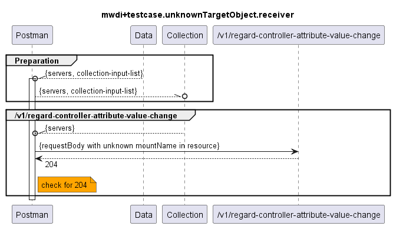

# Functional Testing of Unknown Target Object (in RequestBody) Handling of the Receivers  

  

Notes:
- (1) `/v1/regard-controller-attribute-value-change`: for both known and unknown mount-names a 204 is returned
- (2) `/v1/regard-device-attribute-value-change`: 500 expected
  - the mount-name is provided by the Controller/device itself, not by a 3rd party application or a user, therefore the provided mount-name can be considered valid
  - if it is not known by MWDI then this is not a client/caller error (400), but a MWDI (i.e. server) error 
- (3) `/v1/regard-device-alarm`: 500 expected
  - same logic as for (2), the provided object-path should be found in MWDI, if not it is an MWDI error (5xx), not a client error (400)
- (4) `/v1/regard-device-object-deletion`: 
  - (4.1) unknown mount-name: 500 expected
    - same logic as (2) and (3)
  - (4.2) known mount-name, but unknown class in object-path: 533 expected
- (5) `/v1/regard-device-object-creation`
  - (5.1) unknown mount-name: 404 expected 
    - this is different from (2)-(4), as here upon receipt data for the provided object-path is read from the live network and then written to the MWDI cache
    - normally the object-path should not be invalid (as directly provided by the Controller/device), but it's e.g. possible that until the notification is processed the device e.g. goes into disconnected state or that e.g. the created object was created by mistake and had already been deleted again
    - as the data has first to be read from the live network, an error is to be considered a client 4xx error
    - note: theoretically the controlConstruct for the device could also be unknown in MWDI cache, but this case is not considered here
  - (5.2) known mount-name, but unknown class in object-path: 404 expected

Note: 
- testing both (4.1) and (4.2) with the same simulator is not possible, as the simulators currently only return a single fixed answer
- therefore two separate simulators are provided:
  - `MicroWaveDeviceInventory+simu.unknownTargetObject.unknownMountName.receiver.yaml`: for all tests except (4.2) and (5.2)
  - `MicroWaveDeviceInventory+simu.unknownTargetObject.unknownClass.receiver.yaml`: just for (4.2) and (5.2)