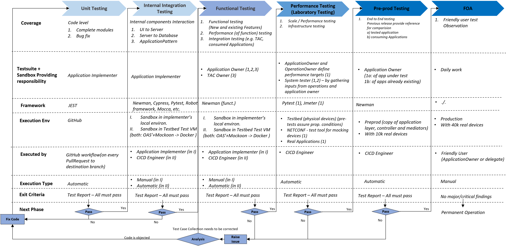

# Testing

Testing is divided into the following six phases:
- [Unit Testing](../server/)
- [Internal Integration Testing](./1_integration/)
- [Functional Testing](./2_functional/)
- [Performance Testing](./3_performance/)
- [Pre-prod Testing](./4_preprod/)
- [FOA](./5_foa/)

