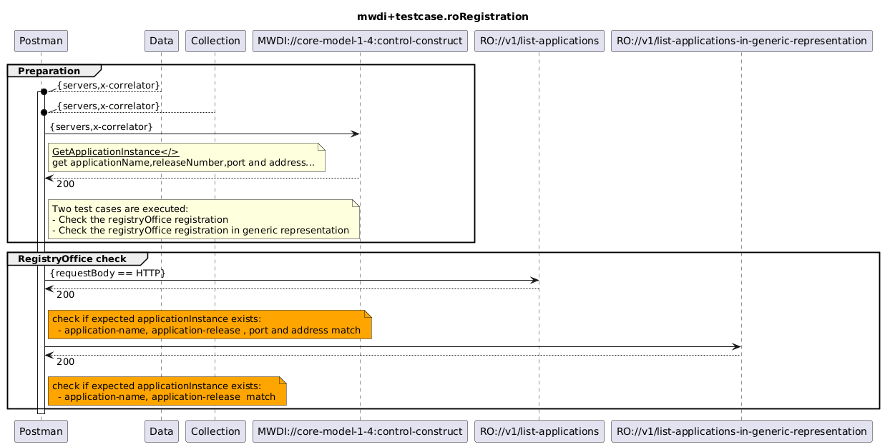

# Functional Testing of RO  registration

## General
All applications will automatically register at the RegistryOffice (RO).
The RegistryOffice is the entry point for all applications to get provisioned in the MW SDN application layer microservice architecture.
It provides functionality to register and deregister an application from the MS environment.
Its main purpose it to create accurate records of the registered applications and to forward it to other components of the TinyApplicationController for further proceeding.
It administrates the list of registered applications.

### Targets
- RegistryOffice registration check for mwdi
- RegistryOffice registration in generic representation check for mwdi

### Criteria
Check if the application Instance exist in the listed application in Registry office
- Steps :
 - Send the request to MWDI to get applicationName, applicationRelease, port and address
 - Check that a corresponding application instance  exists in RO with checking the field : 
  - application-name
  - application-release
  - port
  - address

### Scope
- This test case collection only verifies that application instance exists correctly in the RegistryOffice

## MWDI v2.2.0  
- TestCaseCollection structure:
 - [mwdi.roRegistration]

  